## Kubernetes


传统部署时代->虚拟化部署时代->容器部署时代


### 功能特性：

- **服务发现和负载均衡**
  Kubernetes 可以使用 DNS 名称或自己的 IP 地址公开容器，如果到容器的流量很大，Kubernetes 可以负载均衡并分配网络流量，从而使部署稳定。

- **存储编排**
  Kubernetes 允许您自动挂载您选择的存储系统，例如本地存储、公共云提供商等。

- **自动部署和回滚**
  您可以使用 Kubernetes 描述已部署容器的所需状态，它可以以受控的速率将实际状态更改为所需状态。例如，您可以自动化 Kubernetes 来为您的部署创建新容器，删除现有容器并将它们的所有资源用于新容器。

- **自动二进制打包**
  Kubernetes 允许您指定每个容器所需 CPU 和内存（RAM）。当容器指定了资源请求时，Kubernetes 可以做出更好的决策来管理容器的资源。

- **自我修复**
  Kubernetes 重新启动失败的容器、替换容器、杀死不响应用户定义的运行状况检查的容器，并且在准备好服务之前不将其通告给客户端。

- **密钥与配置管理**
  Kubernetes 允许您存储和管理敏感信息，例如密码、OAuth 令牌和 ssh 密钥。您可以在不重建容器镜像的情况下部署和更新密钥和应用程序配置，也无需在堆栈配置中暴露密钥。

一个 Kubernetes 集群包含 集群由一组被称作节点的机器组成。这些节点上运行 Kubernetes 所管理的容器化应用。集群具有至少一个工作节点和至少一个主节点。

工作节点托管作为应用程序组件的 Pod 。主节点管理集群中的工作节点和 Pod 。多个主节点用于为集群提供故障转移和高可用性。


#### Control Plane

apiserver：restful统一集群入口，交给etcd存储

etcd：键值数据库

scheduler：监视新创建为指定运行节点的Pod，调度决策

controller-manager：

​	节点控制器：故障通知响应

​	副本(Replication)控制器：维护副本Pod数量

​	端点控制器：填充端点对象(加入Service和Pod)

​	服务账户和令牌控制：新命名空间创建账户和API访问令牌

#### Node

kubelet：节点运行代理，保证容器运行在Pod中

kube-proxy：网络代理，维护节点的网络规则

### 核心概念

Pod：最小部署单元，一组容器的集合，一个Pod中容器共享网络

Controller：确保Pod副本数量，确保所有Node运行同一个Pod，一次性任务和定时任务

Service：定义一组Pod的访问规则

## 通过Kubeadm集群配置实例

### Kubeadm核心指令

```shell
# 创建一个 Master 节点
$ kubeadm init
# 将一个 Node 节点加入到当前集群中
$ kubeadm join <Master节点的IP和端口 >
```

### 虚拟机配置

采用Paralles Desktop安装CentOS Minimal系统


安装wget指令：

```shell
yum install wget
```

默认的网络设置是没有enable的，因此，在安装完之后需要开启的话，需要保证开启”Shared Network”, 同时再运行命令”/sbin/dhclient eth0”, 这样虚拟机就可以通过宿主网络来进行访问了。

为了长久性，修改配置

```shell
sudo vi /etc/sysconfig/network-scripts/ifcfg-eth0

# 将其中的ONBOOT改为yes
ONBOOT=yes
# 查询ip地址
ip addr
```

采用FinalShell进行SSH连接，配置三台服务器(一个Master，两个Node)


FinalShell可以实时查看CPU、网络等运行状态


### 环境配置

```shell
# 关闭防火墙
systemctl stop firewalld
systemctl disable firewalld

# 关闭selinux
sed -i 's/enforcing/disabled/' /etc/selinux/config  # 永久
setenforce 0  # 临时

# 关闭swap
swapoff -a  # 临时
sed -ri 's/.*swap.*/#&/' /etc/fstab    # 永久

# 根据规划设置主机名
hostnamectl set-hostname <hostname>

# 在master添加hosts 这里的名字和主机名对应
cat >> /etc/hosts << EOF
192.168.1.14 k8smaster
192.168.1.15 k8snode1
192.168.1.16 k8snode2
EOF

# 将桥接的IPv4流量传递到iptables的链
cat > /etc/sysctl.d/k8s.conf << EOF
net.bridge.bridge-nf-call-ip6tables = 1
net.bridge.bridge-nf-call-iptables = 1
EOF
sysctl --system  # 生效

# 时间同步
yum install ntpdate -y
ntpdate time.windows.com
```

### 节点安装Docker、kubeadm、kubelet

Kubernetes默认CRI(容器运行时)为Docker

1、Docker安装

2、注册阿里云镜像服务

3、添加阿里云yum软件源

```shell
$ cat > /etc/yum.repos.d/kubernetes.repo << EOF
[kubernetes]
name=Kubernetes
baseurl=https://mirrors.aliyun.com/kubernetes/yum/repos/kubernetes-el7-x86_64
enabled=1
gpgcheck=0
repo_gpgcheck=0
gpgkey=https://mirrors.aliyun.com/kubernetes/yum/doc/yum-key.gpg https://mirrors.aliyun.com/kubernetes/yum/doc/rpm-package-key.gpg
EOF
```

4、安装kubeadm、kubelet和kubectl

```shell
yum install -y kubelet-1.18.0 kubeadm-1.18.0 kubectl-1.18.0
systemctl enable kubelet
```

### 部署Master节点

```shell
$ kubeadm init \
  --apiserver-advertise-address=192.168.1.11 \
  --image-repository registry.aliyuncs.com/google_containers \
  --kubernetes-version v1.18.0 \
  --service-cidr=10.96.0.0/12 \
  --pod-network-cidr=10.244.0.0/16
```

使用kubectl工具

```shell
mkdir -p $HOME/.kube
sudo cp -i /etc/kubernetes/admin.conf $HOME/.kube/config
sudo chown $(id -u):$(id -g) $HOME/.kube/config
$ kubectl get nodes
```

### 部署Node节点

```shell
$ kubeadm join 192.168.1.11:6443 --token esce21.q6hetwm8si29qxwn \
    --discovery-token-ca-cert-hash sha256:00603a05805807501d7181c3d60b478788408cfe6cedefedb1f97569708be9c5

# 生成新的token
kubeadm token create --print-join-command
```

### 部署CNI网络插件

```shell
# 地址无法访问，添加IP地址
sudo vi /etc/hosts
199.232.28.133 raw.githubusercontent.com

# 部署插件
kubectl apply -f https://raw.githubusercontent.com/coreos/flannel/master/Documentation/kube-flannel.yml
```

### 集群运行


Master组件：coredns、etcd、flannel-ds、apiserver、controller-manager、proxy、scheduler

Node组件：flannel-ds、proxy

### 测试kubernetes集群pod

```shell
# 新建一个nginx pod
$ kubectl create deployment nginx --image=nginx
$ kubectl expose deployment nginx --port=80 --type=NodePort
$ kubectl get pod,svc
```


可以看到pod已经在运行。根据ip地址加端口号访问，例：192.168.1.11:31557可看到访问结果：


## 通过二进制方式集群配置实例

### 配置三台虚拟机环境


初始化环境配置和adm方式相同。需要配置的环境如下：

| 角色       | IP           | 组件                                                         |
| ---------- | :----------- | ------------------------------------------------------------ |
| k8s-master | 192.168.1.14 | kube-apiserver，kube-controller-manager，kube-scheduler，etcd |
| k8s-node1  | 192.168.1.15 | kubelet，kube-proxy，docker，etcd                            |
| k8s-node2  | 192.168.1.16 | kubelet，kube-proxy，docker，etcd                            |

### 自签证书

为etcd和apiserver自签证书。CFSSL是开源证书管理工具，使用json文件生成证书。

#### 下载配置cfssl

 ```shell
wget https://pkg.cfssl.org/R1.2/cfssl_linux-amd64
wget https://pkg.cfssl.org/R1.2/cfssljson_linux-amd64
wget https://pkg.cfssl.org/R1.2/cfssl-certinfo_linux-amd64
chmod +x cfssl_linux-amd64 cfssljson_linux-amd64 cfssl-certinfo_linux-amd64
mv cfssl_linux-amd64 /usr/local/bin/cfssl
mv cfssljson_linux-amd64 /usr/local/bin/cfssljson
mv cfssl-certinfo_linux-amd64 /usr/local/bin/cfssl-certinfo
 ```

#### 自签证书颁发机构

```shell
#工作目录
mkdir -p ~/TLS/{etcd,k8s}
cd TLS/etcd
```

```shell
#自签CA
cat > ca-config.json<< EOF 
{ 
  "signing": { 
    "default": { 
    	"expiry": "87600h" 
     },
  "profiles": { 
    "www": { 
      "expiry": "87600h", 
      "usages": [ 
        "signing",
        "key encipherment", 
        "server auth", 
        "client auth" 
        ] 
      } 
    } 
  } 
}
EOF

cat > ca-csr.json<< EOF 
{ 
  "CN": "etcd CA", 
  "key": { 
    "algo": "rsa", 
    "size": 2048 
  },
  "names": [ 
    { 
    "C": "CN", 
    "L": "Beijing", 
    "ST": "Beijing" 
    } 
  ] 
}
EOF
```

```shell
#证书生成
cfssl gencert -initca ca-csr.json | cfssljson -bare ca
```

```shell
#使用自签CA签发Etcd HTTPS证书
#证书申请文件：
cat > server-csr.json<< EOF
{
  "CN": "etcd",
  "hosts": ["192.168.1.14", "192.168.1.15", "192.168.1.16"],
  "key": {
    "algo": "rsa",
    "size": 2048
  },
  "names": [{
    "C": "CN",
    "L": "BeiJing",
    "ST": "BeiJing"
  }]
}
EOF
```

```shell
#生成证书
cfssl gencert -ca=ca.pem -ca-key=ca-key.pem -config=ca-config.json -profile=www server-csr.json | cfssljson -bare server
```

生成证书：


### 部署etcd集群

下载etcd：https://github.com/etcd-io/etcd/releases/tag/v3.4.13

```shell
#创建工作目录并解压二进制包
mkdir /opt/etcd/{bin,cfg,ssl} –p
tar zxvf etcd-v3.4.13-linux-amd64.tar.gz
mv etcd-v3.4.13-linux-amd64/{etcd,etcdctl} /opt/etcd/bin/
```

```shell
#etcd配置文件
cat > /opt/etcd/cfg/etcd.conf << EOF
#[Member]
#节点名称
ETCD_NAME="etcd-1"
#数据目录
ETCD_DATA_DIR="/var/lib/etcd/default.etcd"
#集群通信监听地址
ETCD_LISTEN_PEER_URLS="https://192.168.1.14:2380"
#客户端访问监听地址
ETCD_LISTEN_CLIENT_URLS="https://192.168.1.14:2379"
#[Clustering]
#集群通告地址
ETCD_INITIAL_ADVERTISE_PEER_URLS="https://192.168.1.14:2380"
#客户端通告地址
ETCD_ADVERTISE_CLIENT_URLS="https://192.168.1.14:2379" 
#集群节点地址
ETCD_INITIAL_CLUSTER="etcd-1=https://192.168.1.14:2380,etcd-2=https://192.168.1.15:2380,etcd-3=https://192.168.1.16:2380" 
#集群token
ETCD_INITIAL_CLUSTER_TOKEN="etcd-cluster"
#加入集群的当前状态，new新集群，existing已有集群
ETCD_INITIAL_CLUSTER_STATE="new"
EOF
```

```shell
#systemd管理etcd
cat > /usr/lib/systemd/system/etcd.service << EOF
[Unit]
Description=Etcd Server
After=network.target
After=network-online.target
Wants=network-online.target
[Service]
Type=notify
EnvironmentFile=/opt/etcd/cfg/etcd.conf
ExecStart=/opt/etcd/bin/etcd \
--cert-file=/opt/etcd/ssl/server.pem \
--key-file=/opt/etcd/ssl/server-key.pem \
--peer-cert-file=/opt/etcd/ssl/server.pem \
--peer-key-file=/opt/etcd/ssl/server-key.pem \
--trusted-ca-file=/opt/etcd/ssl/ca.pem \
--peer-trusted-ca-file=/opt/etcd/ssl/ca.pem \
--logger=zap
Restart=on-failure
LimitNOFILE=65536
[Install]
WantedBy=multi-user.target
EOF
```

```shell
#拷贝证书
cp ~/TLS/etcd/ca*pem ~/TLS/etcd/server*pem /opt/etcd/ssl/
#设置开机启动
systemctl daemon-reload
systemctl start etcd
systemctl enable etcd
```

```shell
#将生成文件拷贝到其他节点
scp -r /opt/etcd/ root@192.168.1.15:/opt/
scp /usr/lib/systemd/system/etcd.service root@192.168.1.15:/usr/lib/systemd/system/
scp -r /opt/etcd/ root@192.168.1.16:/opt/
scp /usr/lib/systemd/system/etcd.service root@192.168.1.16:/usr/lib/systemd/system/

#分别修改其中的ETCD_NAME和地址为当前ip
vi /usr/lib/systemd/system/etcd.service
```

```shell
#查看集群部署状态
ETCDCTL_API=3 /opt/etcd/bin/etcdctl --cacert=/opt/etcd/ssl/ca.pem --cert=/opt/etcd/ssl/server.pem --key=/opt/etcd/ssl/server-key.pem --endpoints="https://192.168.1.14:2379,https://192.168.1.15:2379,https://192.168.1.16:2379" endpoint health
```

etcd集群已经部署成功


### 安装docker

```shell
#下载docker并配置
wget https://download.docker.com/linux/static/stable/x86_64/docker-19.03.9.tgz
tar zxvf docker-19.03.9.tgz
mv docker/* /usr/bin
```

```shell
#systemd管理docker
cat > /usr/lib/systemd/system/docker.service << EOF
[Unit]
Description=Docker Application Container Engine
Documentation=https://docs.docker.com
After=network-online.target firewalld.service
Wants=network-online.target
[Service]
Type=notify
ExecStart=/usr/bin/dockerd
ExecReload=/bin/kill -s HUP $MAINPID
LimitNOFILE=infinity
LimitNPROC=infinity
LimitCORE=infinity
TimeoutStartSec=0
Delegate=yes
KillMode=process
Restart=on-failure
StartLimitBurst=3
StartLimitInterval=60s
[Install]
WantedBy=multi-user.target
EOF
```

```shell
#创建配置文件
mkdir /etc/docker
cat > /etc/docker/daemon.json << EOF
{
  "registry-mirrors":["https://ach7yopc.mirror.aliyuncs.com"]
}
EOF

#开启docker
systemctl daemon-reload
systemctl start docker
systemctl enable docker
```


### 为apiserver自签证书

自签CA和etcd相同，配置相同。

```shell
#自签CA
cat > ca-config.json<< EOF 
{ 
  "signing": { 
    "default": { 
    	"expiry": "87600h" 
     },
  "profiles": { 
    "kubernetes": { 
      "expiry": "87600h", 
      "usages": [ 
        "signing",
        "key encipherment", 
        "server auth", 
        "client auth" 
        ] 
      } 
    } 
  } 
}
EOF

cat > ca-csr.json<< EOF 
{ 
  "CN": "kubernetes", 
  "key": { 
    "algo": "rsa", 
    "size": 2048 
  },
  "names": [ 
    { 
    "C": "CN", 
    "L": "Beijing", 
    "ST": "Beijing",
    "O": "k8s",
    "OU": "System"
    } 
  ] 
}
EOF
```

```shell
#证书生成
cfssl gencert -initca ca-csr.json | cfssljson -bare ca
```

```shell
#使用自签CA签发kuber-apiserver https证书
cat > server-csr.json<< EOF
{
    "CN":"kubernetes",
    "hosts":[
        "10.0.0.1",
        "127.0.0.1",
        "192.168.1.14",
        "192.168.1.15",
        "192.168.1.16",
        "192.168.1.17",
        "192.168.1.18",
        "192.168.1.19",
        "192.168.1.20",
        "kubernetes",
        "kubernetes.default",
        "kubernetes.default.svc",
        "kubernetes.default.svc.cluster",
        "kubernetes.default.svc.cluster.local"
    ],
    "key":{
        "algo":"rsa",
        "size":2048
    },
    "names":[
        {
            "C":"CN",
            "L":"BeiJing",
            "ST":"BeiJing",
            "O":"k8s",
            "OU":"System"
        }
    ]
}
EOF
```

```shell
#生成证书
cfssl gencert -ca=ca.pem -ca-key=ca-key.pem -config=ca-config.json -profile=kubernetes server-csr.json | cfssljson -bare server
```

### 部署master组件

下载地址：

https://github.com/kubernetes/kubernetes/blob/master/CHANGELOG/CHANGELOG-1.19.md#v1192

```shell
#解压 可执行文件apiserver scheduler controller-manager kubectl
mkdir -p /opt/kubernetes/{bin,cfg,ssl,logs}
tar zxvf kubernetes-server-linux-amd64.tar.gz
cd kubernetes/server/bin
cp kube-apiserver kube-scheduler kube-controller-manager /opt/kubernetes/bin
cp kubectl /usr/bin/
```

#### 部署apiserver

```shell
#apiserver配置文件
cat > /opt/kubernetes/cfg/kube-apiserver.conf << EOF
KUBE_APISERVER_OPTS="--logtostderr=false \\
#日志等级
--v=2 \\
#日志目录
--log-dir=/opt/kubernetes/logs \\
#etcd集群地址
--etcd-servers=https://192.168.1.14:2379,https://192.168.1.15:2379,https://192.168.1.16:2379 \\
#监听地址
--bind-address=192.168.1.14 \\
#https安全端口
--secure-port=6443 \\
#集群通告地址
--advertise-address=192.168.1.14 \\
#启用授权
--allow-privileged=true \\
#Service虚拟IP地址段
--service-cluster-ip-range=10.0.0.0/24 \\
#准入控制模块
--enable-admission-plugins=NamespaceLifecycle,LimitRanger,ServiceAccount,ResourceQuota,NodeRestriction \\
#认证授权，启用RBAC授权和节点自管理
--authorization-mode=RBAC,Node \\
#启用TLS bootstrap机制
--enable-bootstrap-token-auth=true \\
#bootstrap token文件
--token-auth-file=/opt/kubernetes/cfg/token.csv \\
#Service nodeport类型默认分配端口范围
--service-node-port-range=30000-32767 \\
#apiserver访问kubelet客户端证书
--kubelet-client-certificate=/opt/kubernetes/ssl/server.pem \\
--kubelet-client-key=/opt/kubernetes/ssl/server-key.pem \\
#apiserver https证书
--tls-cert-file=/opt/kubernetes/ssl/server.pem \\
--tls-private-key-file=/opt/kubernetes/ssl/server-key.pem \\
--client-ca-file=/opt/kubernetes/ssl/ca.pem \\
--service-account-key-file=/opt/kubernetes/ssl/ca-key.pem \\
#连接etcd集群证书
--etcd-cafile=/opt/etcd/ssl/ca.pem \\
--etcd-certfile=/opt/etcd/ssl/server.pem \\
--etcd-keyfile=/opt/etcd/ssl/server-key.pem \\
#审计日志
--audit-log-maxage=30 \\
--audit-log-maxbackup=3 \\
--audit-log-maxsize=100 \\
--audit-log-path=/opt/kubernetes/logs/k8s-audit.log"
EOF
```

```shell
#将证书拷贝到配置路径
cp ~/TLS/k8s/ca*pem ~/TLS/k8s/server*pem /opt/kubernetes/ssl/
```

#### TLS Bootstraping

Master apiserver 启用 TLS 认证后，Node 节点 kubelet 和 kube-proxy 要与 kube-apiserver 进行通信，必须使用 CA 签发的有效证书才可以，当 Node 节点很多时，这种客户端证书颁发需要大量工作，同样也会增加集群扩展复杂度。为了简化流程，Kubernetes 引入了 TLS bootstraping 机制来自动颁发客户端证书，kubelet 会以一个低权限用户自动向 apiserver 申请证书，kubelet 的证书由 apiserver 动态签署。

```shell
#生成tocken
head -c 16 /dev/urandom | od -An -t x | tr -d ' '

#配置
cat > /opt/kubernetes/cfg/token.csv << EOF
38c9abdf7eea167c6526158f19475b2d,kubelet-bootstrap,10001,"system:node-bootstrapper"
EOF
```

```shell
#systemd管理apiserver
cat > /usr/lib/systemd/system/kube-apiserver.service << EOF
[Unit]
Description=Kubernetes API Server
Documentation=https://github.com/kubernetes/kubernetes
[Service]
EnvironmentFile=/opt/kubernetes/cfg/kube-apiserver.conf
ExecStart=/opt/kubernetes/bin/kube-apiserver \$KUBE_APISERVER_OPTS
Restart=on-failure
[Install]
WantedBy=multi-user.target
EOF
```

```shell
#启动kube-apiserver
systemctl daemon-reload
systemctl start kube-apiserver
systemctl enable kube-apiserver
```

```shell
#授权kubelet-bootstrap用户允许请求证书
kubectl create clusterrolebinding kubelet-bootstrap \
--clusterrole=system:node-bootstrapper \
--user=kubelet-bootstrap
```

#### 部署kube-controller-manager

```shell
cat > /opt/kubernetes/cfg/kube-controller-manager.conf << EOF
KUBE_CONTROLLER_MANAGER_OPTS="--logtostderr=false \\
--v=2 \\
--log-dir=/opt/kubernetes/logs \\
--leader-elect=true \\
--master=127.0.0.1:8080 \\
--bind-address=127.0.0.1 \\
--allocate-node-cidrs=true \\
--cluster-cidr=10.244.0.0/16 \\
--service-cluster-ip-range=10.0.0.0/24 \\
--cluster-signing-cert-file=/opt/kubernetes/ssl/ca.pem \\
--cluster-signing-key-file=/opt/kubernetes/ssl/ca-key.pem \\
--root-ca-file=/opt/kubernetes/ssl/ca.pem \\
--service-account-private-key-file=/opt/kubernetes/ssl/ca-key.pem \\
--experimental-cluster-signing-duration=87600h0m0s"
EOF
```

```shell
#systemd管理controller-manager
cat > /usr/lib/systemd/system/kube-controller-manager.service << EOF
[Unit]
Description=Kubernetes Controller Manager
Documentation=https://github.com/kubernetes/kubernetes
[Service]
EnvironmentFile=/opt/kubernetes/cfg/kube-controller-manager.conf
ExecStart=/opt/kubernetes/bin/kube-controller-manager \$KUBE_CONTROLLER_MANAGER_OPTS
Restart=on-failure
[Install]
WantedBy=multi-user.target
EOF
```

```shell
systemctl daemon-reload
systemctl start kube-controller-manager
systemctl enable kube-controller-manager
```

#### 部署kube-scheduler

```shell
cat > /opt/kubernetes/cfg/kube-scheduler.conf << EOF
KUBE_SCHEDULER_OPTS="--logtostderr=false \
--v=2 \
--log-dir=/opt/kubernetes/logs \
--leader-elect \
--master=127.0.0.1:8080 \
--bind-address=127.0.0.1"
EOF
```

```shell
cat > /usr/lib/systemd/system/kube-scheduler.service << EOF
[Unit]
Description=Kubernetes Scheduler
Documentation=https://github.com/kubernetes/kubernetes
[Service]
EnvironmentFile=/opt/kubernetes/cfg/kube-scheduler.conf
ExecStart=/opt/kubernetes/bin/kube-scheduler \$KUBE_SCHEDULER_OPTS
Restart=on-failure
[Install]
WantedBy=multi-user.target
EOF
```

```shell
systemctl daemon-reload
systemctl start kube-scheduler
systemctl enable kube-scheduler
```

部署完成后可以查看集群运行状态

```shell
kubectl get cs
```

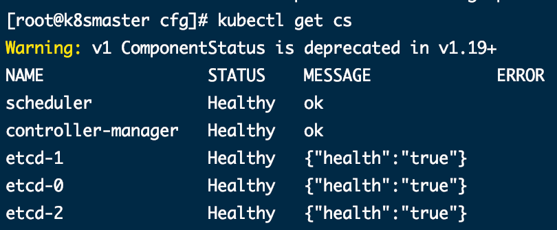

### 部署node组件

在master节点下载的kubernetes中有kubelet和kube-proxy组件

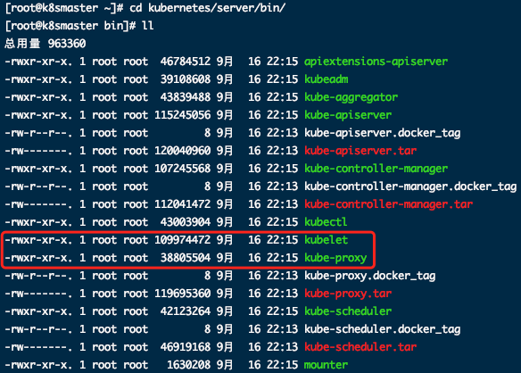

```shell
#工作目录 在master节点操作
mkdir -p /opt/kubernetes/{bin,cfg,ssl,logs}
cd kubernetes/server/bin
cp kubelet kube-proxy /opt/kubernetes/bin # 本地拷贝

# 拷贝到每个node节点
scp kubelet kube-proxy k8snode1:/opt/kubernetes/bin/
scp kubelet kube-proxy k8snode2:/opt/kubernetes/bin/
```

#### 部署kubelet

```shell
#配置文件
cat > /opt/kubernetes/cfg/kubelet.conf << EOF
KUBELET_OPTS="--logtostderr=false \\
--v=2 \\
--log-dir=/opt/kubernetes/logs \\
#显示名称，集群中唯一
--hostname-override=k8smaster \\
#启用CNI插件
--network-plugin=cni \\
#用于连接apiserver
--kubeconfig=/opt/kubernetes/cfg/kubelet.kubeconfig \\
#首次启动向apiserver申请证书
--bootstrap-kubeconfig=/opt/kubernetes/cfg/bootstrap.kubeconfig \\
#配置参数文件
--config=/opt/kubernetes/cfg/kubelet-config.yml \\
#kubelet证书生成目录
--cert-dir=/opt/kubernetes/ssl \\
#管理Pod网络容器的镜像
--pod-infra-container-image=mirrorgooglecontainers/pause-amd64:3.0"
EOF
```

```yml
cat > /opt/kubernetes/cfg/kubelet-config.yml << EOF
kind: KubeletConfiguration
apiVersion: kubelet.config.k8s.io/v1beta1
address: 0.0.0.0
port: 10250
readOnlyPort: 10255
cgroupDriver: cgroupfs
clusterDNS:
- 10.0.0.2
clusterDomain: cluster.local 
failSwapOn: false
authentication:
  anonymous:
    enabled: false
  webhook:
    cacheTTL: 2m0s
    enabled: true
  x509:
    clientCAFile: /opt/kubernetes/ssl/ca.pem 
authorization:
  mode: Webhook
  webhook:
    cacheAuthorizedTTL: 5m0s
    cacheUnauthorizedTTL: 30s
evictionHard:
  imagefs.available: 15%
  memory.available: 100Mi
  nodefs.available: 10%
  nodefs.inodesFree: 5%
maxOpenFiles: 1000000
maxPods: 110
EOF
```

```shell
# bootstrap.kubeconfig
KUBE_APISERVER="https://192.168.1.14:6443" # apiserver IP:PORT
TOKEN="38c9abdf7eea167c6526158f19475b2d" # 与token.csv里保持一致

cd /root/TLS/k8s

# 生成 kubelet bootstrap kubeconfig 配置文件
kubectl config set-cluster kubernetes \
  --certificate-authority=/opt/kubernetes/ssl/ca.pem \
  --embed-certs=true \
  --server=${KUBE_APISERVER} \
  --kubeconfig=bootstrap.kubeconfig
  
kubectl config set-credentials "kubelet-bootstrap" \
  --token=${TOKEN} \
  --kubeconfig=bootstrap.kubeconfig
  
kubectl config set-context default \
  --cluster=kubernetes \
  --user="kubelet-bootstrap" \
  --kubeconfig=bootstrap.kubeconfig
  
kubectl config use-context default --kubeconfig=bootstrap.kubeconfig
```

```shell
#拷贝配置文件路径
cp /root/TLS/k8s/bootstrap.kubeconfig /opt/kubernetes/cfg
```

```shell
# systemd 管理 kubelet
cat > /usr/lib/systemd/system/kubelet.service << EOF
[Unit]
Description=Kubernetes Kubelet
After=docker.service
[Service]
EnvironmentFile=/opt/kubernetes/cfg/kubelet.conf
ExecStart=/opt/kubernetes/bin/kubelet \$KUBELET_OPTS
Restart=on-failure
LimitNOFILE=65536
[Install]
WantedBy=multi-user.target
EOF
```

```shell
# 启动服务
systemctl daemon-reload
systemctl start kubelet
systemctl enable kubelet
```

批准kubelet证书申请并加入集群

```shell
# 查看kubelet证书请求
kubectl get csr
# 批准申请
kubectl certificate approve xxxxxxxxxxx
# 查看节点
kubectl get node
```

由于未部署网络插件，节点回没有准备就绪NotReady

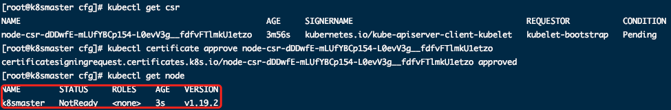

#### 部署kube-proxy

```shell
# 配置文件
cat > /opt/kubernetes/cfg/kube-proxy.conf << EOF
KUBE_PROXY_OPTS="--logtostderr=false \\
--v=2 \\
--log-dir=/opt/kubernetes/logs \\
--config=/opt/kubernetes/cfg/kube-proxy-config.yml"
EOF
```

```yaml
# 配置yml
cat > /opt/kubernetes/cfg/kube-proxy-config.yml << EOF
kind: KubeProxyConfiguration
apiVersion: kubeproxy.config.k8s.io/v1alpha1
bindAddress: 0.0.0.0
metricsBindAddress: 0.0.0.0:10249
clientConnection:
	kubeconfig: /opt/kubernetes/cfg/kube-proxy.kubeconfig
hostnameOverride: k8smaster
clusterCIDR: 10.0.0.0/24
EOF
```

```shell
# 生成kube-proxy证书
# 切换工作目录
cd /usr/local/bin/k8s

# 创建证书请求文件
cat > kube-proxy-csr.json << EOF
{
  "CN": "system:kube-proxy",
  "hosts": [],
  "key": {
    "algo": "rsa",
    "size": 2048
  },
  "names": [
    {
      "C": "CN",
      "L": "BeiJing",
      "ST": "BeiJing",
      "O": "k8s",
      "OU": "System"
    }
  ]
}
EOF

# 生成证书
cfssl gencert -ca=ca.pem -ca-key=ca-key.pem -config=ca-config.json -profile=kubernetes kube-proxy-csr.json | cfssljson -bare kube-proxy

ls kube-proxy*pem
# kube-proxy-key.pem  kube-proxy.pem
```

```shell
# kubeconfig文件
KUBE_APISERVER="https://192.168.1.14:6443"

cd /root/TLS/k8s

kubectl config set-cluster kubernetes \
  --certificate-authority=/opt/kubernetes/ssl/ca.pem \
  --embed-certs=true \
  --server=${KUBE_APISERVER} \
  --kubeconfig=kube-proxy.kubeconfig
  
kubectl config set-credentials kube-proxy \
  --client-certificate=./kube-proxy.pem \
  --client-key=./kube-proxy-key.pem \
  --embed-certs=true \
  --kubeconfig=kube-proxy.kubeconfig
  
kubectl config set-context default \
  --cluster=kubernetes \
  --user=kube-proxy \
  --kubeconfig=kube-proxy.kubeconfig
  
  
kubectl config use-context default --kubeconfig=kube-proxy.kubeconfig
```

```shell
# 拷贝配置文件
cp /root/TLS/k8s/kube-proxy.kubeconfig /opt/kubernetes/cfg/
```

```shell
# systemd管理kube-proxy
cat > /usr/lib/systemd/system/kube-proxy.service << EOF
[Unit]
Description=Kubernetes Proxy
After=network.target
[Service]
EnvironmentFile=/opt/kubernetes/cfg/kube-proxy.conf
ExecStart=/opt/kubernetes/bin/kube-proxy \$KUBE_PROXY_OPTS
Restart=on-failure
LimitNOFILE=65536
[Install]
WantedBy=multi-user.target
EOF
```

```shell
# 启动kube-proxy
systemctl daemon-reload
systemctl start kube-proxy
systemctl enable kube-proxy
```

#### 部署CNI网络

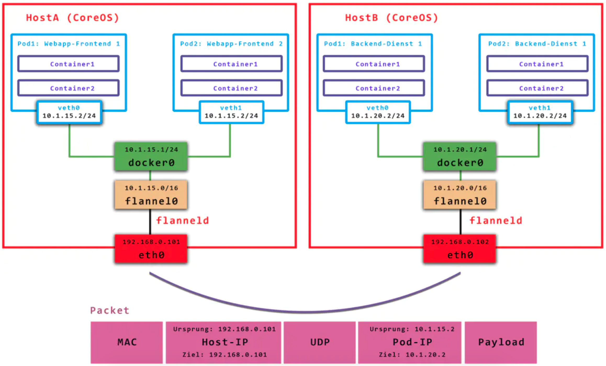

```shell
# https://github.com/containernetworking/plugins/releases/download/v0.8.6/cni-plugins-linux-amd64-v0.8.6.tgz
mkdir -p /opt/cni/bin
tar zxvf cni-plugins-linux-amd64-v0.8.6.tgz -C /opt/cni/bin

# 地址无法访问，添加IP地址
sudo vi /etc/hosts
199.232.28.133 raw.githubusercontent.com

wget https://raw.githubusercontent.com/coreos/flannel/master/Documentation/kube-flannel.yml
kubectl apply -f kube-flannel.yml

kubectl get pods -n kube-system
```

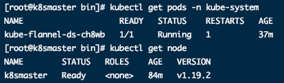

授权apiserver访问kubelet

```shell
cat > apiserver-to-kubelet-rbac.yaml << EOF
apiVersion: rbac.authorization.k8s.io/v1
kind: ClusterRole
metadata:
  annotations:
    rbac.authorization.kubernetes.io/autoupdate: "true"
  labels:
    kubernetes.io/bootstrapping: rbac-defaults
  name: system:kube-apiserver-to-kubelet
rules:
  - apiGroups:
      - ""
    resources:
      - nodes/proxy
      - nodes/stats
      - nodes/log
      - nodes/spec
      - nodes/metrics
      - pods/log
    verbs:
      - "*"
---
apiVersion: rbac.authorization.k8s.io/v1
kind: ClusterRoleBinding
metadata:
  name: system:kube-apiserver
  namespace: ""
roleRef:
  apiGroup: rbac.authorization.k8s.io
  kind: ClusterRole
  name: system:kube-apiserver-to-kubelet
subjects:
  - apiGroup: rbac.authorization.k8s.io
    kind: User
    name: kubernetes
EOF

kubectl apply -f apiserver-to-kubelet-rbac.yaml
```

```shell
# 增加新的Node节点
scp -r /opt/kubernetes k8snode2:/opt/
scp -r /usr/lib/systemd/system/{kubelet,kube-proxy}.service k8snode2:/usr/lib/systemd/system
scp -r /opt/cni/ k8snode2:/opt/
scp /opt/kubernetes/ssl/ca.pem k8snode2:/opt/kubernetes/ssl

# 证书申请审批后自动生成，删除重新生成
rm /opt/kubernetes/cfg/kubelet.kubeconfig 
rm -f /opt/kubernetes/ssl/kubelet*

# 修改主机名
vi /opt/kubernetes/cfg/kubelet.conf
--hostname-override=k8snode1
vi /opt/kubernetes/cfg/kube-proxy-config.yml
hostnameOverride: k8snode1
```

```shell
# 启动kubelet和kube-proxy
systemctl daemon-reload
systemctl start kubelet
systemctl enable kubelet
systemctl start kube-proxy
systemctl enable kube-proxy
```

在master批准node kubelet证书申请

```shell
kubectl get csr
kubectl certificate approve xxxxxxxxx
```

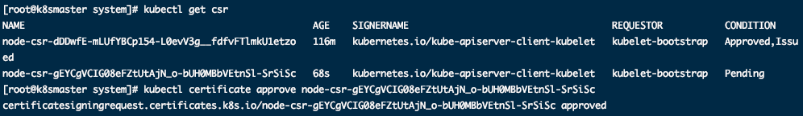

查看Node状态，各个节点已正常运行中

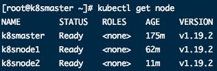

## 基本概念

### K8S内部关系

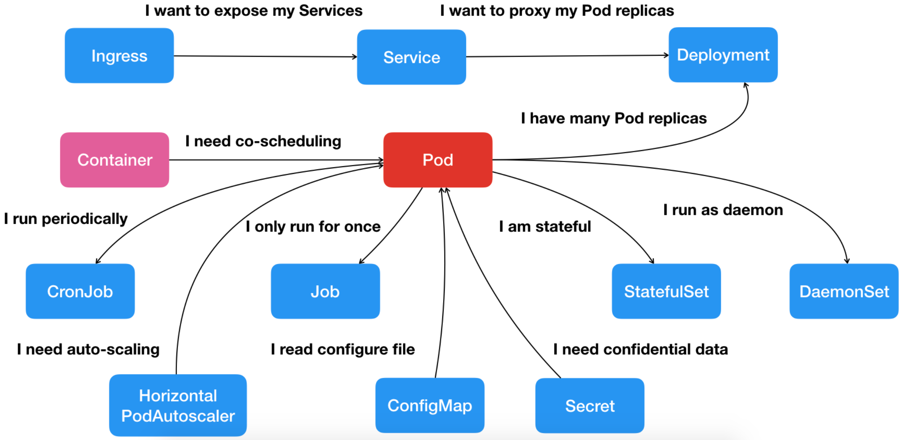

### kubectl命令行工具

```shell
# 帮助
kubectl --help
# 创建pod例子
kubectl create deployment nginx --image=nginx
# 暴露端口
kubectl expose deployment nginx --port=80 --type=NodePort
# 查看端口信息
kubectl get pod,svc
# 查看组件状态
kubectl get cs
# 查看节点运行状态
kubectl get nodes
```

### yaml文件

```yaml
apiVersion: apps/v1
kind: Deployment
metadata:
  name: nginx-deployment
  namespace: default
spec:
  replicas: 3
  selector:
    matchLabels:
      app: nginx
  template:
    metadata:
      labels:
        app: nginx
    spec:
      containers:
      - name: nginx
      image: nginx:1.15
      port:
      - containerPort: 80
```

|    名称    | 内容       |    名称    | 美容       |
| :--------: | ---------- | :--------: | ---------- |
| apiversion | API版本    |    kind    | 资源类型   |
|  metadata  | 资源元数据 |    spec    | 资源规格   |
|  replicas  | 副本数量   |  selector  | 标签选择器 |
|  template  | Pod模板    |  metadata  | Pod元数据  |
|    spec    | Pod规格    | containers | 容器配置   |

#### create生成yaml文件

```shell
# 生成yaml文件
kubectl create deployment web --image=nginx -o yaml --dry-run > my1.yaml
```

#### get导出yaml文件

```shell
# 已部署好的项目
kubectl get deploy
# 导出yaml
kubectl get deploy nginx -o=yaml --export > my2.yaml
```

### Pod

多进程设计——最小部署单元，可包含多个容器(一组容器的集合)，一个pod中容器共享网络命名空间。

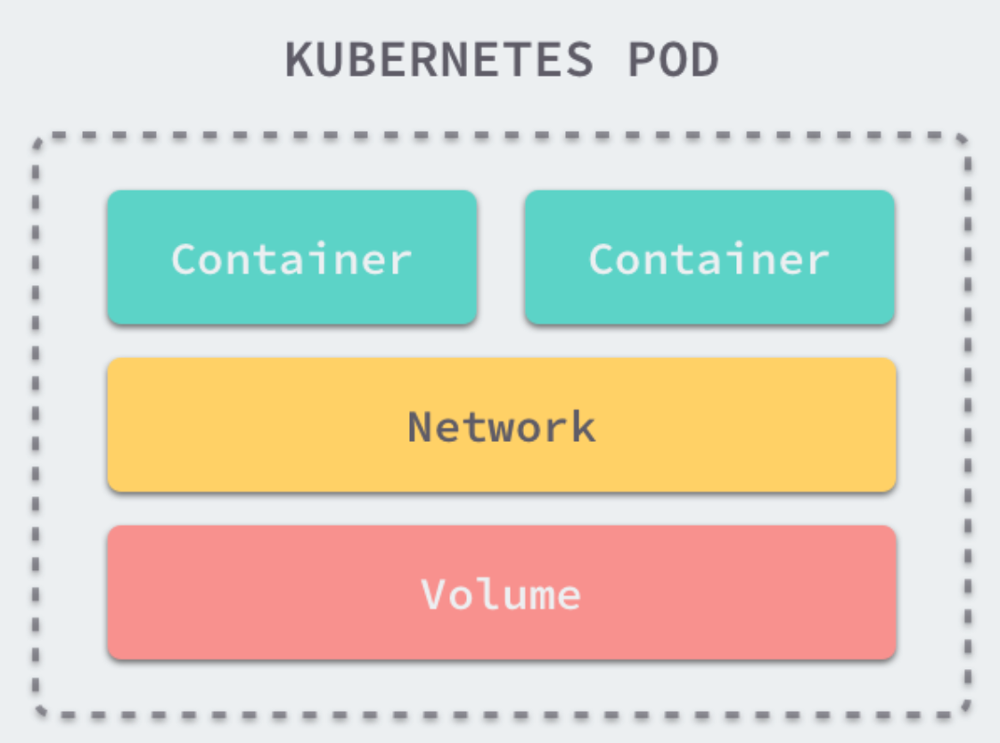

1、共享网络：通过Pause容器，把其他业务容器加入Pause容器中，同一个名称空间网络共享

2、共享存储：数据卷加载，持久化存储

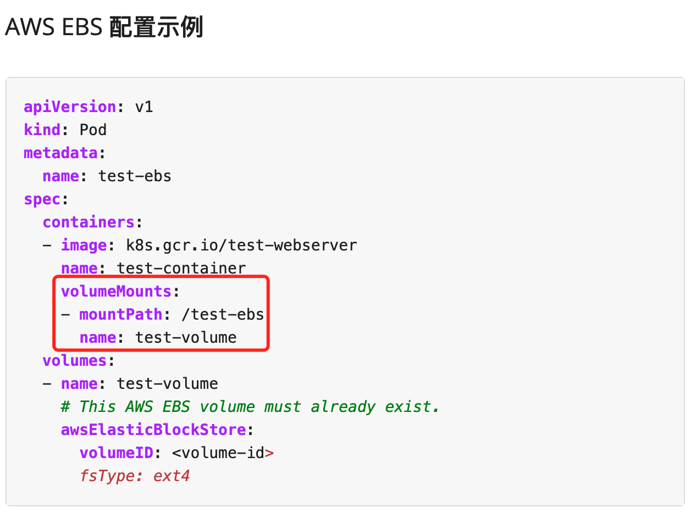

#### Pod镜像拉取策略

```yaml
spec.containers[].imagePullPolicy: Always
     # IfNotPresent: 默认，镜像在宿主机不存在时才拉去
     # Always: 每次创建Pod都重新拉取
     # Never: Pod永远不会主动拉取这个镜像
```

#### Pod资源限制(由docker实现的)

```yaml
# 限制
spec.containers[].resources.limits.cpu: "500m" # 1核心=500m
spec.containers[].resources.limits.memory: "64Mi"
# 请求
spec.containers[].resources.requests.cpu
spec.containers[].resources.requests.memory
```

#### Pod重启策略

```yaml
# Always: 容器中只推出后，总是重启
# OnFailure: 容器异常退出（退出状态码非0）时重启
# Never: 终止退出从不重启
spec.restartPolicy: Never
```

#### Pod健康检查

```yaml
# 应用层面健康检查
# livenessProbe 存活检查 检查失败杀死容器，根据Pod的restartPolicy才做
# readinessProbe 就绪检查 检查失败将Pod从service endpoints中剔除
spec.containers[].livenessProbe:
  exec:
    command:
    - cat
    - /tmp/healthy
  imitialDelaySeconds: 5
  periodSecounds: 5

# Probe支持三种检查方法：
#    httpGet 发送请求，返回200-400为成功
#    exec 执行shell命令返回状态吗0为成功
#    tcpSocket 发起TCP Socket建立成功
```

#### Pod调度策略

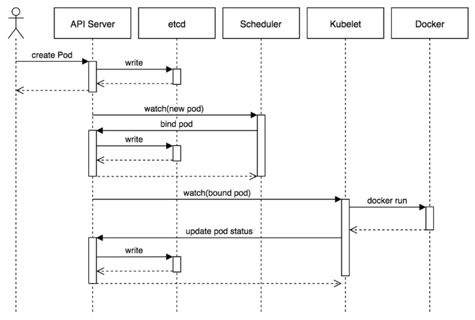

Pod创建过程：

	1. Createpod -- apiserver -- etcd
 	2. scheduler -- apiserver -- etcd -- 调度算法，把pod调度某个node节点上
 	3. node节点kubelet -- apiserver --读取etcd拿到分配给当前节点pod -- docker创建容器


##### 标签选择器nodeSelector

```shell
# 指定分组
kubectl label node k8snode1 env_role=dev
# 显示标签信息
kubectl get nodes k8snode1 --show-labels
```

```yaml
# 配置节点选择器
spec.nodeSelector.env_role: dev
```


##### 节点亲和性nodeAffinity

```yaml
spec:
  affinity:
    nodeAffinity:
      # 硬亲和性 必须满足约束条件
      requiredDuringSchedulingIgnoredDuringExecution:
        nodeSelectorTerms:
        - matchExpressions: # 必须满足env_role为dev或者test
          - key: env_role
            operator: In
            values:
            - dev
            - test
       # 软亲和性 不保证满足约束条件
       preferredDuringSchedulingIgnoredDuringExecution:
       - weight: 1 # 权重系数
         preference:
           matchExpressions: # 尝试满足，不保证绝对，若不存在依旧进行调度
           - key: group
             operator: In
             values:
             - otherprod
             
# 操作符 operator:
#		In 范围
#   NotIn 不在范围
#	  Exists 存在
#	  Gt 大于
#   Lt 小于
#	  DoesNotExists 不存在   
```


##### 污点和污点容忍Taint

nodeSelector和nodeAffinity为Pod属性，调度时实现。Taint节点不做普通分配调度，是节点的属性

场景：专用节点/配置特定硬件节点/基于Taint驱逐

污点：

```shell
# 查看节点污点情况
kubectl describe node k8smaster | grep Taint
#三个值：
#   NoSchedule: 一定不被调度
#   PreferNoSchedule: 尽量不被调度
#   NoExecute: 不会调度，并且驱逐Node已有Pod

# 为节点添加污点
kubectl taint node [node] key=value:污点值
# 删除污点
kubectl taint node [node] key=value:污点值-
```

污点容忍：（类似于软亲和性）

```yaml
spec:
  tolerations:
  - key: "env_role"
    operator: "Equal"
    value: "value"
    effect: "NoSchedule"
```


### Controller

#### Controller (Deployment)

在集群上管理和运行容器的对象，也叫做**工作负载**


##### Deployment 

应用场景：

​	部署无状态应用

​	管理Pod和ReplicaSet

​	部署、滚动升级等功能

​	应用场景：web服务、微服务

Pod和Controller通过**标签labels**建立联系，实现运维操作如伸缩、滚动升级等

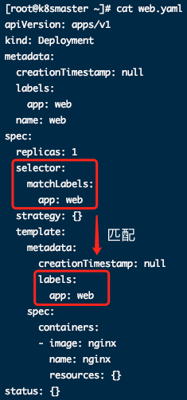

```shell
# 生成yaml文件
kubectl create deployment web --image=nginx --dry-run -o yaml > web.yaml
# 应用部署
kubectl apply -f web.yaml
kubectl get pods
# 生成暴露端口的yaml文件
kubectl expose deployment web --port=80 --type=NodePort --target-port=80 --name=web1 -o yaml > web1.yaml
# svc->service
kubectl get pod,svc
```

升级、回滚、弹性伸缩

```shell
# 将nginx升级到1.15版本
kubectl set image deployment web nginx=nginx:1.15
# 查看应用升级状态
kubectl rollout status deployment web
# 查看历史变化
kubectl rollout history deployment web
# 回滚
kubectl rollout undo deployment web
kubectl roolout undo deployment web --to-reversion=1
# 弹性伸缩(在线扩容)
kubectl scale deployment web --replicas=10
```


##### Service

定义一组Pod的访问规则，Service和Pod通过labels和selector标签建立关系。

1. 防止Pod失联（服务发现）
2. 定义一组Pod访问策略（负载均衡）

**常用类型**

​	ClusterIP：集群内部使用（默认）

​	NodePort：对外访问应用使用

​	LoadBalancer：对外访问，公有云

```shell
# 修改方式:
spec.type: NodePort

# 生成yaml文件
kubectl create deployment web --image=nginx --dry-run -o yaml > web.yaml
# 应用部署
kubectl apply -f web.yaml
# 端口暴露
kubectl expose deployment web --port=80 --target-port=80 --dry-run -o yaml > service.yaml
# apply
kubectl apply -f service.yaml

```


#### Controller (StatefulSet)

无状态：Pod相同，没有顺序要求，无需考虑在哪个node中运行，随意伸缩和扩展

有状态：每个pod独立，保持启动顺序和唯一性（唯一的网络标示符），持久存储，有序（例如mysql主从）

##### 部署有状态应用

无头service：ClusterIP : none

```yaml
apiVersion: v1
kind: Service #无头service
metadata:
  name: nginx
  labels:
    app: nginx
spec:
  ports:
  - port: 80
    name: web
  clusterIP: None #None配置
  selector:
    app: nginx
---
apiVersion: apps/v1
kind: StatefulSet #有状态应用敷在管理控制器API
metadata:
  name: web-statefulset #名称
  namespace: default #名称空间
spec:
  serviceName: "nginx"
  replicas: 2
  selector:
     matchLabels:
       app: nginx
  template:
    metadata:
      labels:
        app: nginx
    spec:
      containers:
      - name: nginx
        image: docker.io/nginx
        ports:
        - containerPort: 80
          name: web
        volumeMounts:
        - name: www
          mountPath: /usr/share/nginx/html
  volumeClaimTemplates:
  - metadata:
      name: www
    spec:
      accessModes: ["ReadWriteOnce"]
      volumeMode: Filesystem
      resources:
        requests:
          storage: 50Mi
      storageClassName: local-storage
```

Deployment和StatefulSet区别：有身份的（唯一标示）

​	根据主机名和一定规则生成域名：**主机名.service名称.名称空间.svc.cluster.local**

​	web-statefulset-0.web.default.svc.cluster.local


#### Controller (DaemonSet)

守护进程：确保node运行同一个pod

```yaml
kind: DaemonSet #守护
```

启动并进入守护进程：

```shell
# 部署守护进程
kubectl apply -f test.yml
# 进入pod之中
kubectl exec -it [Pod名] bash
```


#### Controller (Job)

job：一次性任务 / cronjob：定时任务

```yaml
apiVersion: batch/v1
kind: Job #一次性任务将结果logs打出
metadata:
  name: pi
spec:
  template:
    spec:
      containers:
      - name: pi
        image: perl
        command: ["perl", "-Mbignum=bpi", "-wle", "print bpi(2000)"]
      restartPolicy: Never
  backoffLimit: 4
```

查看任务执行情况

```shell
kubectl logs [服务名]
```

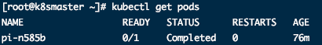

执行后任务显示Completed

```shell
kubectl delete -f job.yaml
```


#### Controller (CronJob)

```yaml
apiVersion: batch/v1
kind: CronJob
metadata:
  name: hello
spec:
  schedule: "*/1 * * * *" #cron表达式
  jobTemplate:
    spec:
      template:
        spec:
          containers:
          - name: hello
            image: busybox
            args:
            - /bin/sh
            - -c
            - date; echo Hello from the Kubernetes cluster
          restartPolicy: OnFailure
```


### Secret

对数据进行加密，存储在etcd中，让pod容器以挂载volume的方式进行访问。

```shell
# 输出base64加密后的admin
echo -n 'admin' | base64
```

场景：凭证，base64编码

```yaml
apiVersion: v1
kind: Secret
metadata:
  name: mysecret
type: Opaque
data:
  username: [加密后用户名]
  password: [加密后密码]
```

```shell
# 创建secret
kubectl create -f secret.yaml
```

#### 以变量形式挂载

```yaml
apiVersion: v1
kind: Pod
metadata:
  name: mypod
spec:
  containers:
  - name: nginx
    image: nginx
    env:
      - name: SECRET_USERNAME
        valueFrom:
          secretKeyRef: # 变量挂载
            name: mysecret
            key: username
      - name: SECRET_PASSWORD
        valueFrom:
          secretKeyRef:
            name: mysecret
            key: password
```

```shell
# 创建pod
kubectl apply -f secret-val.yaml
# 进入pod
kubectl exec -it mypod bash
# 输出变量
echo $SECRET_USERNAME
```

#### 以volume形式挂载

```yaml
apiVersion: v1
kind: Pod
metadata:
  name: mypod
spec:
  containers:
  - name: nginx
    image: nginx
    volumeMounts: #卷挂载
    - name: foo
      mountPath: "/etc/foo"
      readOnly: true
  volumes:
  - name: foo
    secret:
      secretName: mysecret
```

```shell
# 创建pod
kubectl apply -f secret-vol.yaml
# 进入容器
kubectl exec -it mypod bash
# 查看挂载的变量
cd /etc/foo
cat password
```


### ConfigMap配置管理

存储不加密数据到etcd中，pod以变量或数据卷挂载，多用于配置文件

```shell
# 创建configmap
kubectl create configmap redis-config --from-file=redis.properties
# 查看configmap
kubectl get cm
kubectl describe cm redis-config
```

#### volume挂载

```yaml
apiVersion: v1
kind: Pod
metadata:
  name: mypod
spec:
  containers:
  - name: busybox
    image: busybox
    command: ["/bin/sh", "-c", "cat /etc/config/redis.properties"]
    volumeMounts: #卷挂载
    - name: config-volume
      mountPath: /etc/config
  volumes:
  - name: config-volume
    configMap:  #configmap名称挂载
      name: redis-config
  restartPolicy: Never
```

```shell
# 查看日志
kubectl logs mypod
```

#### 变量挂载

```yaml
apiVersion: v1
kind: ConfigMap
metadata:
  name: myconfig
  namespace: default
data: #数据部分
  special.level: info
  special.type: hello
```

```shell
kubectl apply -f myconfig.yaml
kubectl get cm
```

```yaml
apiVersion: v1
kind: Pod
metadata:
  name: mypod
spec:
  containers:
  - name: busybox
    image: busybox
    command: ["/bin/sh", "-c", "echo $(LEVEL) $(TYPE)"]
    env:
      - name: LEVEL
        valueFrom:
          configMapKeyRef: #变量挂载
            name: myconfig
            key: special.level
      - name: TYPE
        valueFrom:
          configMapKeyRef:
            name: myconfig
            key: special.type
  restartPolicy: Never
```


### K8S集群安全机制

访问k8s集群时，需要经过三个步骤：

1. 认证
2. 鉴权（授权）
3. 准入控制

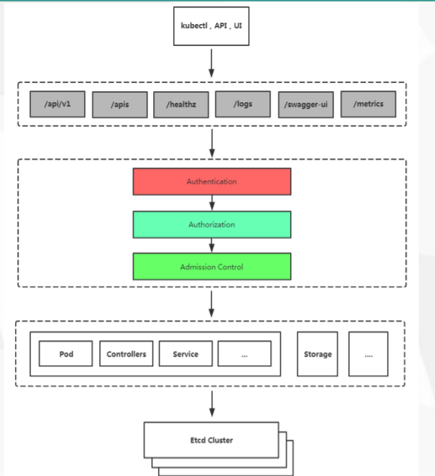

均需要经过apiserver ---- 统一协调

**传输安全**：对外不暴露8080端口，只能内部访问。对外使用端口6443

**认证**：客户端认证常用方式：

​	https证书认证，基于ca证书

​	http token认证，通过token识别用户

​	http基本认证，用户名+密码

**鉴权**：基于RBAC（基于角色的访问控制）鉴权

**准入控制**：准入列表，存在则通过，否则拒绝。


#### RBAC

Role-Based Access Control  基于角色的访问控制

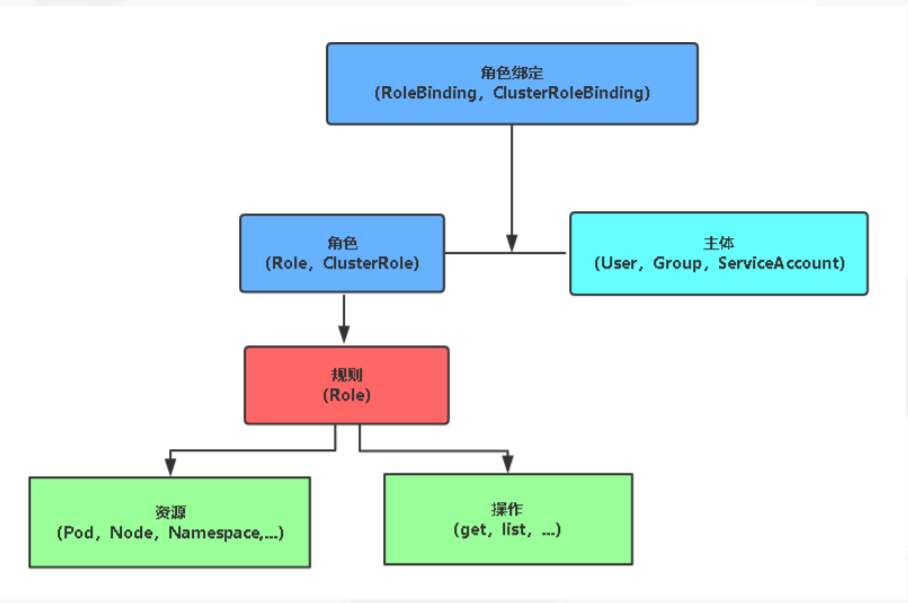

**角色**：

​	role：特定命名空间访问

​	clusterrole：所有命名空间访问权限

**角色绑定**：

​	roleBinding：角色绑定到主体

​	clusterRoleBinding：集群角色绑定到主体

**RBAC实现鉴权**：

1. 创建命名空间并创建pod

```shell
# 创建命名空间
kubectl create ns roledemo
# 查看命名空间
kubectl get ns
# 在命名空间下创建pod
kubectl run nginx --image=nginx -n roledemo
```

2. 创建角色

```yaml
# 角色yaml
kind: Role
apiVersion: rbac.authorization.k8s.io/v1
metadata:
  namespace: roledemo
  name: pod-reader
rules:
- apiGroups: [""] # ""表示core API group
  resources: ["pods"] # 仅对pods有操作权限
  verbs: ["get", "watch", "list"]
```

```shell
# 创建角色
kubectl apply -f rbac-role.yaml
kubectl get role -n roledemo
```

3. 创建角色与用户绑定

```yaml
# 用户yaml
kind: RoleBinding
apiVersion: rbac.authorization.k8s.io/v1
metadata:
  name: read-pods
  namespace: roletest
subjects:
- kind: User
  name: lucy
  apiGroup: rbac.authorization.k8s.io
roleRef:
  kind: Role # Role或者ClusterRole
  name: pod-reader #绑定的Role名字
  apiGroup: rbac.authorization.k8s.io
```

```shell
# 绑定用户与角色
kubectl apply -f rbac-rolebinding.yaml
# 获取绑定值
kubectl get role,rolebinding -n roledemo
```

4. 角色证书

```sh
# 和前述相同，生成证书文件
cat > lucy-csr.json<< EOF
cfssl gencert -initca ca-csr.json | cfssljson -bare ca
# ......
```


### Ingress

原先方式：暴露端口，ip+端口号访问：使用Service中的NodePort类型，每个节点都会启动端口。

**Ingress作为统一入口**，由service关联一组pod

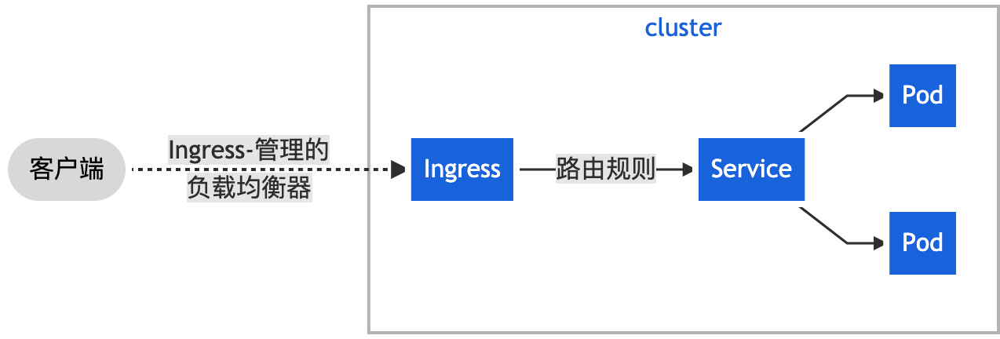

1. **部署ingress Controller**

```shell
# 构建nginx应用
kubectl create deployment web --image=nginx
# expose暴露端口
kubectl expose deployment web --port=80 --target-port=80 --type=NodePort
```

**部署官方维护的ingress controller（nginx）**

```yaml
apiVersion: v1
kind: Namespace
metadata:
  name: ingress-nginx
  labels:
    app.kubernetes.io/name: ingress-nginx
    app.kubernetes.io/part-of: ingress-nginx

---

kind: ConfigMap
apiVersion: v1
metadata:
  name: nginx-configuration
  namespace: ingress-nginx
  labels:
    app.kubernetes.io/name: ingress-nginx
    app.kubernetes.io/part-of: ingress-nginx

---
kind: ConfigMap
apiVersion: v1
metadata:
  name: tcp-services
  namespace: ingress-nginx
  labels:
    app.kubernetes.io/name: ingress-nginx
    app.kubernetes.io/part-of: ingress-nginx

---
kind: ConfigMap
apiVersion: v1
metadata:
  name: udp-services
  namespace: ingress-nginx
  labels:
    app.kubernetes.io/name: ingress-nginx
    app.kubernetes.io/part-of: ingress-nginx

---
apiVersion: v1
kind: ServiceAccount
metadata:
  name: nginx-ingress-serviceaccount
  namespace: ingress-nginx
  labels:
    app.kubernetes.io/name: ingress-nginx
    app.kubernetes.io/part-of: ingress-nginx

---
apiVersion: rbac.authorization.k8s.io/v1beta1
kind: ClusterRole
metadata:
  name: nginx-ingress-clusterrole
  labels:
    app.kubernetes.io/name: ingress-nginx
    app.kubernetes.io/part-of: ingress-nginx
rules:
  - apiGroups:
      - ""
    resources:
      - configmaps
      - endpoints
      - nodes
      - pods
      - secrets
    verbs:
      - list
      - watch
  - apiGroups:
      - ""
    resources:
      - nodes
    verbs:
      - get
  - apiGroups:
      - ""
    resources:
      - services
    verbs:
      - get
      - list
      - watch
  - apiGroups:
      - "extensions"
    resources:
      - ingresses
    verbs:
      - get
      - list
      - watch
  - apiGroups:
      - ""
    resources:
      - events
    verbs:
      - create
      - patch
  - apiGroups:
      - "extensions"
    resources:
      - ingresses/status
    verbs:
      - update

---
apiVersion: rbac.authorization.k8s.io/v1beta1
kind: Role
metadata:
  name: nginx-ingress-role
  namespace: ingress-nginx
  labels:
    app.kubernetes.io/name: ingress-nginx
    app.kubernetes.io/part-of: ingress-nginx
rules:
  - apiGroups:
      - ""
    resources:
      - configmaps
      - pods
      - secrets
      - namespaces
    verbs:
      - get
  - apiGroups:
      - ""
    resources:
      - configmaps
    resourceNames:
      # Defaults to "<election-id>-<ingress-class>"
      # Here: "<ingress-controller-leader>-<nginx>"
      # This has to be adapted if you change either parameter
      # when launching the nginx-ingress-controller.
      - "ingress-controller-leader-nginx"
    verbs:
      - get
      - update
  - apiGroups:
      - ""
    resources:
      - configmaps
    verbs:
      - create
  - apiGroups:
      - ""
    resources:
      - endpoints
    verbs:
      - get

---
apiVersion: rbac.authorization.k8s.io/v1beta1
kind: RoleBinding
metadata:
  name: nginx-ingress-role-nisa-binding
  namespace: ingress-nginx
  labels:
    app.kubernetes.io/name: ingress-nginx
    app.kubernetes.io/part-of: ingress-nginx
roleRef:
  apiGroup: rbac.authorization.k8s.io
  kind: Role
  name: nginx-ingress-role
subjects:
  - kind: ServiceAccount
    name: nginx-ingress-serviceaccount
    namespace: ingress-nginx

---
apiVersion: rbac.authorization.k8s.io/v1beta1
kind: ClusterRoleBinding
metadata:
  name: nginx-ingress-clusterrole-nisa-binding
  labels:
    app.kubernetes.io/name: ingress-nginx
    app.kubernetes.io/part-of: ingress-nginx
roleRef:
  apiGroup: rbac.authorization.k8s.io
  kind: ClusterRole
  name: nginx-ingress-clusterrole
subjects:
  - kind: ServiceAccount
    name: nginx-ingress-serviceaccount
    namespace: ingress-nginx

---

apiVersion: apps/v1
kind: DaemonSet 
metadata:
  name: nginx-ingress-controller
  namespace: ingress-nginx
  labels:
    app.kubernetes.io/name: ingress-nginx
    app.kubernetes.io/part-of: ingress-nginx
spec:
  selector:
    matchLabels:
      app.kubernetes.io/name: ingress-nginx
      app.kubernetes.io/part-of: ingress-nginx
  template:
    metadata:
      labels:
        app.kubernetes.io/name: ingress-nginx
        app.kubernetes.io/part-of: ingress-nginx
      annotations:
        prometheus.io/port: "10254"
        prometheus.io/scrape: "true"
    spec:
      hostNetwork: true
      serviceAccountName: nginx-ingress-serviceaccount
      containers:
        - name: nginx-ingress-controller
          image: siriuszg/nginx-ingress-controller:0.20.0
          args:
            - /nginx-ingress-controller
            - --configmap=$(POD_NAMESPACE)/nginx-configuration
            - --tcp-services-configmap=$(POD_NAMESPACE)/tcp-services
            - --udp-services-configmap=$(POD_NAMESPACE)/udp-services
            - --publish-service=$(POD_NAMESPACE)/ingress-nginx
            - --annotations-prefix=nginx.ingress.kubernetes.io
          securityContext:
            allowPrivilegeEscalation: true
            capabilities:
              drop:
                - ALL
              add:
                - NET_BIND_SERVICE
            # www-data -> 33
            runAsUser: 33
          env:
            - name: POD_NAME
              valueFrom:
                fieldRef:
                  fieldPath: metadata.name
            - name: POD_NAMESPACE
              valueFrom:
                fieldRef:
                  fieldPath: metadata.namespace
          ports:
            - name: http
              containerPort: 80
            - name: https
              containerPort: 443
          livenessProbe:
            failureThreshold: 3
            httpGet:
              path: /healthz
              port: 10254
              scheme: HTTP
            initialDelaySeconds: 10
            periodSeconds: 10
            successThreshold: 1
            timeoutSeconds: 10
          readinessProbe:
            failureThreshold: 3
            httpGet:
              path: /healthz
              port: 10254
              scheme: HTTP
            periodSeconds: 10
            successThreshold: 1
            timeoutSeconds: 10

---
apiVersion: v1
kind: Service
metadata:
  name: ingress-nginx
  namespace: ingress-nginx
spec:
  #type: NodePort
  ports:
  - name: http
    port: 80
    targetPort: 80
    protocol: TCP
  - name: https
    port: 443
    targetPort: 443
    protocol: TCP
  selector:
    app.kubernetes.io/name: ingress-nginx
    app.kubernetes.io/part-of: ingress-nginx
```

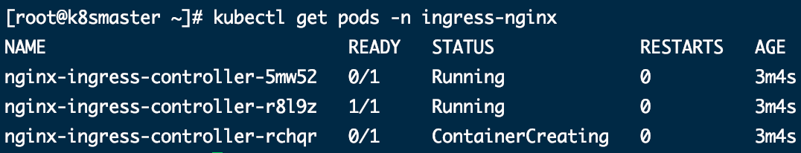

2. **创建ingress规则**

````yaml
apiVersion: networking.k8s.io/v1beta1
kind: Ingress # ingress规则
metadata:
  name: example-ingress
spec:
  rules: # 规则
  - host: example.ingredemo.com # 访问域名
    http:
      paths:
      - path: /
        backend:
          serviceName: web # 应用名称
          servicePort: 80  # 端口
````

采用v1版本：

```yaml
apiVersion: networking.k8s.io/v1
kind: Ingress
metadata:
  name: example-ingress
spec:
  rules:
  - host: foo.bar.com
    http:
      paths:
      - path: /
        pathType: Prefix
        backend:
          service:
            name: web
            port:
              number: 80
```

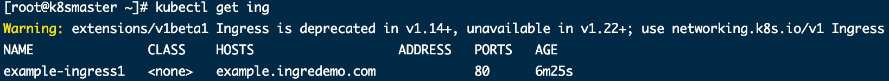

在本机配置host文件：

```shell
sudo vi /etc/hosts
# 在host文件中加入
192.168.1.14	example.ingredemo.com
```

可直接通过域名访问：

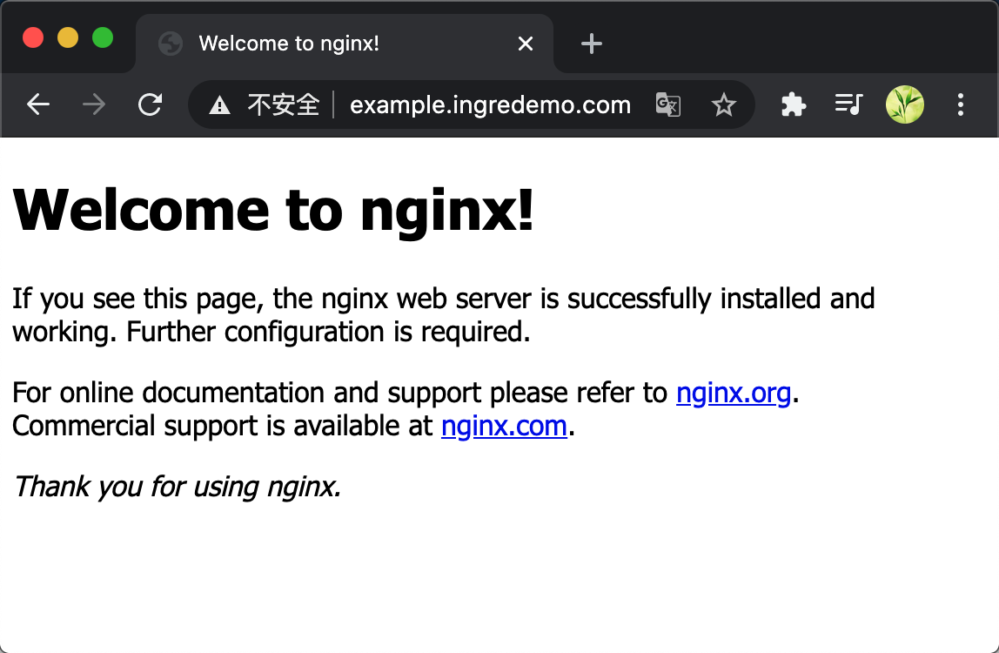


### Helm

**Kubernetes包管理工具**

原部署应用方式编写yaml文件： Deployment ---- Service 暴露端口 ---- Ingress

**需要维护大量yaml文件**，不利于版本管理，利用helm进行yaml整体管理及复用；应用级别的版本管理。

1. Helm

命令行客户端工具，用于k8s应用chart的创建、打包、发布和管理。

2. Chart

应用描述，一系列用于描述k8s资源相关文件的集合。

3. Release

基于Chart的部署实体，chart被运行后生成对应的release，在k8s中创建真实运行的资源对象。

**Helm架构变化：**

v3删除tiller；release可在不同命名空间中重用；chart推送到docker仓库中

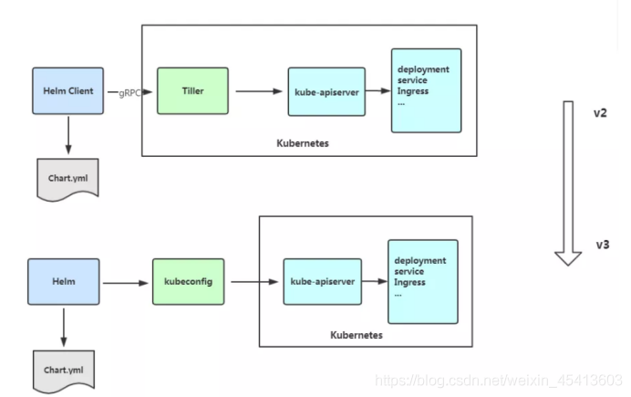

**Helm下载**

```shell
wget https://get.helm.sh/helm-v3.3.4-linux-amd64.tar.gz
tar -zxvf helm-v3.3.4-linux-amd64.tar.gz
mv linux-amd64/helm /usr/local/bin/helm
# 配置helm仓库
helm repo add stable https://kubernetes.oss-cn-hangzhou.aliyuncs.com/charts
helm repo list
```

**Helm部署操作**

```shell
helm search repo 名称
helm install 安装名 搜索的应用名
helm list
helm status 安装名
# 修改yaml后应用升级
helm upgrade web mychart/
# 暴露端口
kubectl edit svc 服务名 # 在yaml文件中修改类型为type: NodePort
```

**创建自己的Chart**

```shell
helm create mychart
cd mychart
```

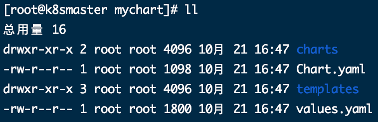

Chart.yaml：当前chart属性配置信息

templates：编写的yaml文件，如service、deployment、ingress等

values.yaml：yaml文件中可以使用的全局变量

```shell
kubectl create deployment web --image=nginx --dry-run -o yaml > deployment.yaml
kubectl expose deployment web --port=80 --target-port=80 --type=NodePort --dry-run -o yaml > service.yaml
```

```yaml
# valuse.yaml中定义变量和值
replicas: 1
image: nginx
tag: 1.16
label: nginx
port: 80
```

在templates的yaml文件中使用valuse.yaml中定义的变量

```yaml
# 表达式 {{ .Values.变量名称}}
# 动态生成Release名称 {{ .Release.Name}}
metadata:
  name: {{ .Release.Name}}.deploy
# ......
image: {{ .Values.image}}
# ......
app: {{ .Values.label}}
```


### 持久化存储

1. **nfs 网络存储**

```shell
# nfs服务端安装nfs
yum install -y nfs-utils

# 设置挂载路径
vi /etc/exports # 在其中设置目录
# /data/nfs/*(rw.no_root_squash)

# 在k8s集群node节点上同样安装nfs
# 在nfs服务端启动nfs
systemctl start nfs
systemctl enabale nfs

```

```yaml
# 在k8s集群部署应用并使用nfs持久网络存储
apiVersion: app/v1
kind: Deployment
metadata:
  name: nginx-dep1
spec:
  replicas: 1
  selector:
    matchLabels:
      app: nginx
  template:
    metadata:
      labels:
        app: nginx
    spec:
      containers:
      - name: nginx
        image: nginx
        volumeMounts:
        - name: wwwroot
          mountPath: /usr/share/nginx/ # 挂载的位置
        ports:
        - containerPort: 80
      volumes:
        - name: wwwroot
          nfs: # 挂载网络nfs
            server: 192.168.1.17 # nfs服务地址
            path: /data/nfs
```

2. **PV和PVC**

PV：持久化存储，对存储资源抽象，对外提供可以调用的地方（生产者）

PVC：用于调用，不需要关心内部实现细节（消费者）

```yaml
# nginx服务
apiVersion: app/v1
kind: Deployment
metadata:
  name: nginx-dep
spec:
  replicas: 3
  selector:
    matchLabels:
      app: nginx
  template:
    metadata:
      labels:
        app: nginx
    spec:
      containers:
      - name: nginx
        image: nginx
        volumeMounts:
        - name: wwwroot
          mountPath: /usr/share/nginx/ # 挂载的位置
        ports:
        - containerPort: 80
      volumes:
        - name: wwwroot
          persistentVolumeClaim: #挂载pvc
            claimName: my-pvc #pvc名称
            
---

# PVC
apiVersion: v1
kind: PersistentVolumeClaim
metadata:
  name: my-pvc
spec:
  accessModes:
    - ReadWriteMany
  resources:
    requests:
      storage:5Gi
```

```yaml
# PV
apiVersion: v1
kind: PersistentVolume
metadata:
  name: my-pv
spec:
  capacity:
    storage: 5Gi
  accessModes:
    - ReadWriteMany
  nfs:
    path: /k8s/nfs
    server: 192.168.1.19
```


### K8S集群资源监控

**监控指标**

集群监控：节点资源利用率、节点数、运行pods

Pod监控：容器指标、应用程序

**监控平台**

prometheus：开源；监控、报警、数据库；以Http协议周期性抓取被监控组件状态

grafana：开源数据分析和可视化工具，支持多种数据源


#### 部署Prometheus

```yaml
# Configmap.yaml变量文件
apiVersion: v1
kind: ConfigMap
metadata:
  name: prometheus-config
  namespace: kube-system
data:
  prometheus.yml: |
    global:
      scrape_interval:     15s
      evaluation_interval: 15s
    scrape_configs:

    - job_name: 'kubernetes-apiservers'
      kubernetes_sd_configs:
      - role: endpoints
      scheme: https
      tls_config:
        ca_file: /var/run/secrets/kubernetes.io/serviceaccount/ca.crt
      bearer_token_file: /var/run/secrets/kubernetes.io/serviceaccount/token
      relabel_configs:
      - source_labels: [__meta_kubernetes_namespace, __meta_kubernetes_service_name, __meta_kubernetes_endpoint_port_name]
        action: keep
        regex: default;kubernetes;https

    - job_name: 'kubernetes-nodes'
      kubernetes_sd_configs:
      - role: node
      scheme: https
      tls_config:
        ca_file: /var/run/secrets/kubernetes.io/serviceaccount/ca.crt
      bearer_token_file: /var/run/secrets/kubernetes.io/serviceaccount/token
      relabel_configs:
      - action: labelmap
        regex: __meta_kubernetes_node_label_(.+)
      - target_label: __address__
        replacement: kubernetes.default.svc:443
      - source_labels: [__meta_kubernetes_node_name]
        regex: (.+)
        target_label: __metrics_path__
        replacement: /api/v1/nodes/${1}/proxy/metrics

    - job_name: 'kubernetes-cadvisor'
      kubernetes_sd_configs:
      - role: node
      scheme: https
      tls_config:
        ca_file: /var/run/secrets/kubernetes.io/serviceaccount/ca.crt
      bearer_token_file: /var/run/secrets/kubernetes.io/serviceaccount/token
      relabel_configs:
      - action: labelmap
        regex: __meta_kubernetes_node_label_(.+)
      - target_label: __address__
        replacement: kubernetes.default.svc:443
      - source_labels: [__meta_kubernetes_node_name]
        regex: (.+)
        target_label: __metrics_path__
        replacement: /api/v1/nodes/${1}/proxy/metrics/cadvisor

    - job_name: 'kubernetes-service-endpoints'
      kubernetes_sd_configs:
      - role: endpoints
      relabel_configs:
      - source_labels: [__meta_kubernetes_service_annotation_prometheus_io_scrape]
        action: keep
        regex: true
      - source_labels: [__meta_kubernetes_service_annotation_prometheus_io_scheme]
        action: replace
        target_label: __scheme__
        regex: (https?)
      - source_labels: [__meta_kubernetes_service_annotation_prometheus_io_path]
        action: replace
        target_label: __metrics_path__
        regex: (.+)
      - source_labels: [__address__, __meta_kubernetes_service_annotation_prometheus_io_port]
        action: replace
        target_label: __address__
        regex: ([^:]+)(?::\d+)?;(\d+)
        replacement: $1:$2
      - action: labelmap
        regex: __meta_kubernetes_service_label_(.+)
      - source_labels: [__meta_kubernetes_namespace]
        action: replace
        target_label: kubernetes_namespace
      - source_labels: [__meta_kubernetes_service_name]
        action: replace
        target_label: kubernetes_name

    - job_name: 'kubernetes-services'
      kubernetes_sd_configs:
      - role: service
      metrics_path: /probe
      params:
        module: [http_2xx]
      relabel_configs:
      - source_labels: [__meta_kubernetes_service_annotation_prometheus_io_probe]
        action: keep
        regex: true
      - source_labels: [__address__]
        target_label: __param_target
      - target_label: __address__
        replacement: blackbox-exporter.example.com:9115
      - source_labels: [__param_target]
        target_label: instance
      - action: labelmap
        regex: __meta_kubernetes_service_label_(.+)
      - source_labels: [__meta_kubernetes_namespace]
        target_label: kubernetes_namespace
      - source_labels: [__meta_kubernetes_service_name]
        target_label: kubernetes_name

    - job_name: 'kubernetes-ingresses'
      kubernetes_sd_configs:
      - role: ingress
      relabel_configs:
      - source_labels: [__meta_kubernetes_ingress_annotation_prometheus_io_probe]
        action: keep
        regex: true
      - source_labels: [__meta_kubernetes_ingress_scheme,__address__,__meta_kubernetes_ingress_path]
        regex: (.+);(.+);(.+)
        replacement: ${1}://${2}${3}
        target_label: __param_target
      - target_label: __address__
        replacement: blackbox-exporter.example.com:9115
      - source_labels: [__param_target]
        target_label: instance
      - action: labelmap
        regex: __meta_kubernetes_ingress_label_(.+)
      - source_labels: [__meta_kubernetes_namespace]
        target_label: kubernetes_namespace
      - source_labels: [__meta_kubernetes_ingress_name]
        target_label: kubernetes_name

    - job_name: 'kubernetes-pods'
      kubernetes_sd_configs:
      - role: pod
      relabel_configs:
      - source_labels: [__meta_kubernetes_pod_annotation_prometheus_io_scrape]
        action: keep
        regex: true
      - source_labels: [__meta_kubernetes_pod_annotation_prometheus_io_path]
        action: replace
        target_label: __metrics_path__
        regex: (.+)
      - source_labels: [__address__, __meta_kubernetes_pod_annotation_prometheus_io_port]
        action: replace
        regex: ([^:]+)(?::\d+)?;(\d+)
        replacement: $1:$2
        target_label: __address__
      - action: labelmap
        regex: __meta_kubernetes_pod_label_(.+)
      - source_labels: [__meta_kubernetes_namespace]
        action: replace
        target_label: kubernetes_namespace
      - source_labels: [__meta_kubernetes_pod_name]
        action: replace
        target_label: kubernetes_pod_name

```

```yaml
# prometheus.deploy.yml 部署
---
apiVersion: apps/v1
kind: Deployment
metadata:
  labels:
    name: prometheus-deployment
  name: prometheus
  namespace: kube-system
spec:
  replicas: 1
  selector:
    matchLabels:
      app: prometheus
  template:
    metadata:
      labels:
        app: prometheus
    spec:
      containers:
      - image: prom/prometheus:v2.0.0
        name: prometheus
        command:
        - "/bin/prometheus"
        args:
        - "--config.file=/etc/prometheus/prometheus.yml"
        - "--storage.tsdb.path=/prometheus"
        - "--storage.tsdb.retention=24h"
        ports:
        - containerPort: 9090
          protocol: TCP
        volumeMounts:
        - mountPath: "/prometheus"
          name: data
        - mountPath: "/etc/prometheus"
          name: config-volume
        resources:
          requests:
            cpu: 100m
            memory: 100Mi
          limits:
            cpu: 500m
            memory: 2500Mi
      serviceAccountName: prometheus    
      volumes:
      - name: data
        emptyDir: {}
      - name: config-volume
        configMap:
          name: prometheus-config   

```

```yaml
# prometheus.svc.yml 服务暴露
---
kind: Service
apiVersion: v1
metadata:
  labels:
    app: prometheus
  name: prometheus
  namespace: kube-system
spec:
  type: NodePort
  ports:
  - port: 9090
    targetPort: 9090
    nodePort: 30003
  selector:
    app: prometheus

```

```yaml
# rbac-setup.yaml 服务角色权限配置
apiVersion: rbac.authorization.k8s.io/v1
kind: ClusterRole
metadata:
  name: prometheus
rules:
- apiGroups: [""]
  resources:
  - nodes
  - nodes/proxy
  - services
  - endpoints
  - pods
  verbs: ["get", "list", "watch"]
- apiGroups:
  - extensions
  resources:
  - ingresses
  verbs: ["get", "list", "watch"]
- nonResourceURLs: ["/metrics"]
  verbs: ["get"]
---
apiVersion: v1
kind: ServiceAccount
metadata:
  name: prometheus
  namespace: kube-system
---
apiVersion: rbac.authorization.k8s.io/v1
kind: ClusterRoleBinding
metadata:
  name: prometheus
roleRef:
  apiGroup: rbac.authorization.k8s.io
  kind: ClusterRole
  name: prometheus
subjects:
- kind: ServiceAccount
  name: prometheus
  namespace: kube-system

```

```yaml
# node-exporter.yaml node节点的监控
---
apiVersion: apps/v1
kind: DaemonSet
metadata:
  name: node-exporter
  namespace: kube-system
  labels:
    k8s-app: node-exporter
spec:
  selector:
    matchLabels:
      k8s-app: node-exporter
  template:
    metadata:
      labels:
        k8s-app: node-exporter
    spec:
      containers:
      - image: prom/node-exporter
        name: node-exporter
        ports:
        - containerPort: 9100
          protocol: TCP
          name: http
---
apiVersion: v1
kind: Service
metadata:
  labels:
    k8s-app: node-exporter
  name: node-exporter
  namespace: kube-system
spec:
  ports:
  - name: http
    port: 9100
    nodePort: 31672
    protocol: TCP
  type: NodePort
  selector:
    k8s-app: node-exporter

```

执行后部署完成

```shell
kubectl get pods -n kube-system
```

#### 部署Grafana

```yaml
# grafana-deploy.yaml
apiVersion: apps/v1
kind: Deployment
metadata:
  name: grafana-core
  namespace: kube-system
  labels:
    app: grafana
    component: core
spec:
  replicas: 1
  selector:
    matchLabels:
      app: grafana
      component: core
  template:
    metadata:
      labels:
        app: grafana
        component: core
    spec:
      containers:
      - image: grafana/grafana:4.2.0
        name: grafana-core
        imagePullPolicy: IfNotPresent
        # env:
        resources:
          # keep request = limit to keep this container in guaranteed class
          limits:
            cpu: 100m
            memory: 100Mi
          requests:
            cpu: 100m
            memory: 100Mi
        env:
          # The following env variables set up basic auth twith the default admin user and admin password.
          - name: GF_AUTH_BASIC_ENABLED
            value: "true"
          - name: GF_AUTH_ANONYMOUS_ENABLED
            value: "false"
          # - name: GF_AUTH_ANONYMOUS_ORG_ROLE
          #   value: Admin
          # does not really work, because of template variables in exported dashboards:
          # - name: GF_DASHBOARDS_JSON_ENABLED
          #   value: "true"
        readinessProbe:
          httpGet:
            path: /login
            port: 3000
          # initialDelaySeconds: 30
          # timeoutSeconds: 1
        volumeMounts:
        - name: grafana-persistent-storage
          mountPath: /var
      volumes:
      - name: grafana-persistent-storage
        emptyDir: {}

```

```yaml
# grafana-ing.yaml
apiVersion: extensions/v1beta1
kind: Ingress
metadata:
   name: grafana
   namespace: kube-system
spec:
   rules:
   - host: k8s.grafana
     http:
       paths:
       - path: /
         backend:
          serviceName: grafana
          servicePort: 3000

```

```yaml
# grafana-svc.yaml
apiVersion: v1
kind: Service
metadata:
  name: grafana
  namespace: kube-system
  labels:
    app: grafana
    component: core
spec:
  type: NodePort
  ports:
    - port: 3000
  selector:
    app: grafana
    component: core

```

#### 构建监控

部署后可查看服务运行状态

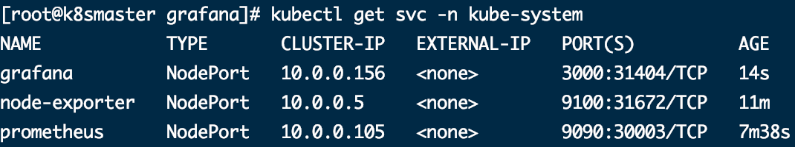

访问grafana，初始用户名密码均为admin

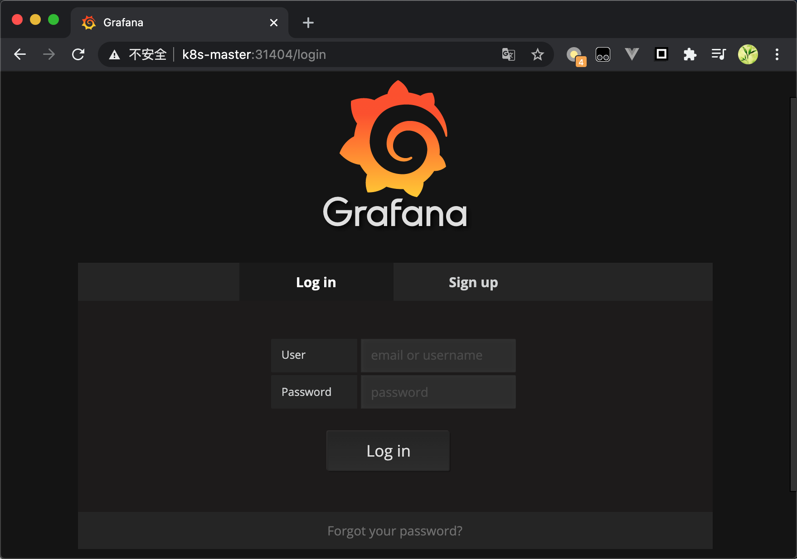

数据源配置，选用普罗米修斯

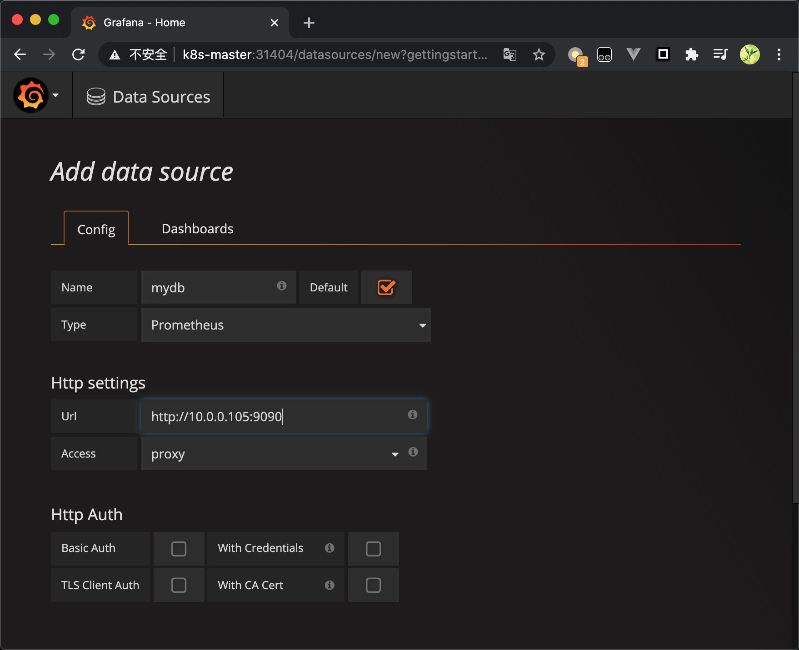

设置显示数据模板，采用k8s的监控模板

https://grafana.com/grafana/dashboards/315

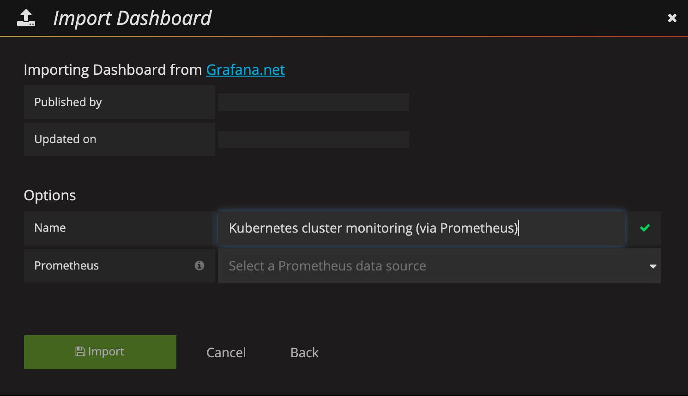


## 搭建高可用集群

| 角色          | IP           |
| ------------- | ------------ |
| master1       | 192.168.1.18 |
| master2       | 192.168.1.19 |
| node1         | 192.168.1.20 |
| VIP（虚拟ip） | 192.168.1.21 |

在master中需要部署keepalived，haproxy(负载均衡)，及apiserver、controller-manager、scheduler..

### 部署keepalived

master节点部署keepalived

```shell
yum install -y conntrack-tools libseccomp libtool-ltdl
yum install -y keepalived
```

master1节点配置

```shell
cat > /etc/keepalived/keepalived.conf <<EOF 
! Configuration File for keepalived

global_defs {
   router_id k8s
}

vrrp_script check_haproxy {
    script "killall -0 haproxy"
    interval 3
    weight -2
    fall 10
    rise 2
}

vrrp_instance VI_1 {
    state MASTER 
    interface ens33 
    virtual_router_id 51
    priority 250
    advert_int 1
    authentication {
        auth_type PASS
        auth_pass ceb1b3ec013d66163d6ab
    }
    virtual_ipaddress {
        192.168.1.21
    }
    track_script {
        check_haproxy
    }

}
EOF
```

master2节点配置

```shell
cat > /etc/keepalived/keepalived.conf <<EOF 
! Configuration File for keepalived

global_defs {
   router_id k8s
}

vrrp_script check_haproxy {
    script "killall -0 haproxy"
    interval 3
    weight -2
    fall 10
    rise 2
}

vrrp_instance VI_1 {
    state BACKUP 
    interface ens33 
    virtual_router_id 51
    priority 200
    advert_int 1
    authentication {
        auth_type PASS
        auth_pass ceb1b3ec013d66163d6ab
    }
    virtual_ipaddress {
        192.168.1.21
    }
    track_script {
        check_haproxy
    }

}
EOF
```

启动并检查

```shell
systemctl start keepalived.service
systemctl enable keepalived.service
systemctl status keepalived.service
ip a s eth0
```

### 部署haproxy

```shell
yum install -y haproxy
```

配置文件:两台master节点的配置均相同，配置中声明了后端代理的两个master节点服务器，指定了haproxy运行的端口为16443等，因此16443端口为集群的入口

```shell
cat > /etc/haproxy/haproxy.cfg << EOF
#---------------------------------------------------------------------
# Global settings
#---------------------------------------------------------------------
global
    # to have these messages end up in /var/log/haproxy.log you will
    # need to:
    # 1) configure syslog to accept network log events.  This is done
    #    by adding the '-r' option to the SYSLOGD_OPTIONS in
    #    /etc/sysconfig/syslog
    # 2) configure local2 events to go to the /var/log/haproxy.log
    #   file. A line like the following can be added to
    #   /etc/sysconfig/syslog
    #
    #    local2.*                       /var/log/haproxy.log
    #
    log         127.0.0.1 local2
    
    chroot      /var/lib/haproxy
    pidfile     /var/run/haproxy.pid
    maxconn     4000
    user        haproxy
    group       haproxy
    daemon 
       
    # turn on stats unix socket
    stats socket /var/lib/haproxy/stats
#---------------------------------------------------------------------
# common defaults that all the 'listen' and 'backend' sections will
# use if not designated in their block
#---------------------------------------------------------------------  
defaults
    mode                    http
    log                     global
    option                  httplog
    option                  dontlognull
    option http-server-close
    option forwardfor       except 127.0.0.0/8
    option                  redispatch
    retries                 3
    timeout http-request    10s
    timeout queue           1m
    timeout connect         10s
    timeout client          1m
    timeout server          1m
    timeout http-keep-alive 10s
    timeout check           10s
    maxconn                 3000
#---------------------------------------------------------------------
# kubernetes apiserver frontend which proxys to the backends
#--------------------------------------------------------------------- 
frontend kubernetes-apiserver
    mode                 tcp
    bind                 *:16443
    option               tcplog
    default_backend      kubernetes-apiserver    
#---------------------------------------------------------------------
# round robin balancing between the various backends
#---------------------------------------------------------------------
backend kubernetes-apiserver
    mode        tcp
    balance     roundrobin
    server      master01.k8s.io   192.168.1.18:6443 check
    server      master02.k8s.io   192.168.1.19:6443 check
#---------------------------------------------------------------------
# collection haproxy statistics message
#---------------------------------------------------------------------
listen stats
    bind                 *:1080
    stats auth           admin:awesomePassword
    stats refresh        5s
    stats realm          HAProxy\ Statistics
    stats uri            /admin?stats
EOF
```

启动并检查

```shell
systemctl enable haproxy
systemctl start haproxy
systemctl status haproxy
netstat -lntup|grep haproxy
```

### 节点安装Docker/kubeadm/kubelet/kubectl

[采用kubeadm章节中的方式安装](#节点安装Docker、kubeadm、kubelet)并配置即可

```shell
cat >> /etc/hosts << EOF
192.168.1.21    master.k8s.io   k8s-vip
192.168.1.18    master01.k8s.io master1
192.168.1.19    master02.k8s.io master2
192.168.1.20    node01.k8s.io   node1
EOF
```


### 部署Master

创建kubeadm配置文件

```shell
# 在vip master操作，即master1
mkdir /usr/local/kubernetes/manifests -p
cd /usr/local/kubernetes/manifests/
vi kubeadm-config.yaml
```

````yaml
apiServer:
  certSANs:
    - master1
    - master2
    - master.k8s.io
    - 192.168.1.18
    - 192.168.1.19
    - 192.168.1.21
    - 127.0.0.1
  extraArgs:
    authorization-mode: Node,RBAC
  timeoutForControlPlane: 4m0s
apiVersion: kubeadm.k8s.io/v1beta1
certificatesDir: /etc/kubernetes/pki
clusterName: kubernetes
controlPlaneEndpoint: "master.k8s.io:16443"
controllerManager: {}
dns: 
  type: CoreDNS
etcd:
  local:    
    dataDir: /var/lib/etcd
imageRepository: registry.aliyuncs.com/google_containers
kind: ClusterConfiguration
kubernetesVersion: v1.18.0
networking: 
  dnsDomain: cluster.local  
  podSubnet: 10.244.0.0/16
  serviceSubnet: 10.1.0.0/16
scheduler: {}
````

```shell
kubeadm init --config kubeadm-config.yaml
```

```shell
# 配置环境变量
mkdir -p $HOME/.kube
sudo cp -i /etc/kubernetes/admin.conf $HOME/.kube/config
sudo chown $(id -u):$(id -g) $HOME/.kube/config
kubectl get nodes
kubectl get pods -n kube-system
```

```shell
# 加入--control-plane表示master加入集群
kubeadm join master.k8s.io:16443 --token cnf4ay.j56f487khfiv3u43 \
    --discovery-token-ca-cert-hash sha256:e8da75c046c6fcd7753bdbf0a9145c25a5eb49818d022dd9f4724ca1e59ef5d0 \
    --control-plane 
```


### 安装集群网络

```shell
mkdir flannel
cd flannel
wget -c https://raw.githubusercontent.com/coreos/flannel/master/Documentation/kube-flannel.yml
# 安装
kubectl apply -f kube-flannel.yml
# 检查
kubectl get pods -n kube-system
```

master1已经启动：

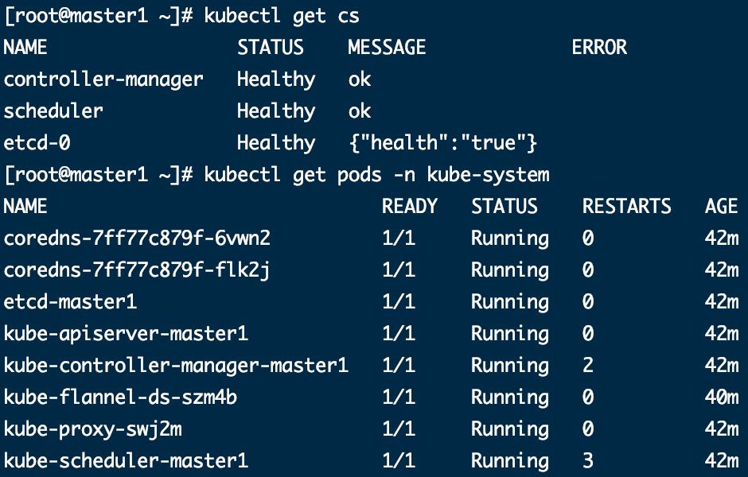

Master2加入集群

拷贝秘钥文件

```shell
# ssh root@192.168.1.19 mkdir -p /etc/kubernetes/pki/etcd

# scp /etc/kubernetes/admin.conf root@192.168.1.19:/etc/kubernetes
   
# scp /etc/kubernetes/pki/{ca.*,sa.*,front-proxy-ca.*} root@192.168.1.19:/etc/kubernetes/pki
   
# scp /etc/kubernetes/pki/etcd/ca.* root@192.168.1.19:/etc/kubernetes/pki/etcd
```

执行加入的kubeadm join指令即可

node加入也志雄kubeadm join

### **可能问题**

1. 对于kubeadm join 打印日志：

```shell
k8s Could not find a JWS signature in the cluster-info ConfigMap for token ID "vezzap"

kubeadm join —
error execution phase preflight: couldn’t validate the identity of the API Server: abort connecting to API servers after timeout of 5m0s
```

此原因为没有token，或者token失效，需重新生成token

```shell
kubeadm token create

openssl x509 -pubkey -in /etc/kubernetes/pki/ca.crt | openssl rsa -pubin -outform der 2>/dev/null | \
openssl dgst -sha256 -hex | sed 's/^.* //'
```

将新获取到的token和--discovery-token-ca-cert-hash替换join命令中的位置即可。

2. 出现虚拟ip未生效

```shell
Unable to connect to the server: dial tcp 192.168.0.132:16443: connect: no route to host
```

重启keepalived

```shell
systemctl restart keepalived.service
ip a s eth0
```

### 测试集群运行

```shell
kubectl create deployment nginx --image=nginx
kubectl expose deployment nginx --port=80 --type=NodePort
kubectl get pod,svc
```

## K8S集群部署项目

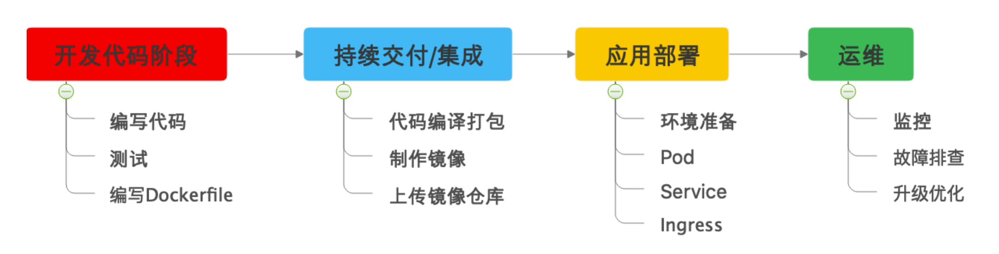

1. java打包(jar或者war包：java -jar/直接部署在tomcat)，并编写Dockerfile

```shell
mvn clean package
```

2. Docker镜像制作

```shell
docker build -t mytomcat .
# 查看镜像
docker images
# 本地测试
docker run -d -p 8000:8000 mytomcat -t
```

3. 上传镜像到镜像服务器中
4. 构建k8s

```shell
# 创建yaml文件
kubectl create deployment javademo --image=xxxx --dir-run -o yaml > javademo.yaml
# 执行
kubectl apply -f javademo.yaml
# 查看
kubectl get pods -o wide
# 扩容
kubectl scale deployment javademo --replicas=3
# 服务暴露Service(或者采用Ingress)
kubectl expose deployment javademo --port=8000 --target-port=8000 --type=NodePort
```

## 参考

mac下Paralles配置CentOS网络：https://www.cnblogs.com/ghj1976/p/3746375.html

环境搭建1：https://www.cnblogs.com/liuyi778/p/12771259.html

环境搭建2：https://www.cnblogs.com/oscarli/p/12737409.html

CFSSL证书生成：https://blog.csdn.net/sujosu/article/details/101520260

K8S安全机制：https://www.cnblogs.com/benjamin77/p/12446780.html


## Fin

Kubernetes学习笔记

Jackyjinchen

2020年10月24日