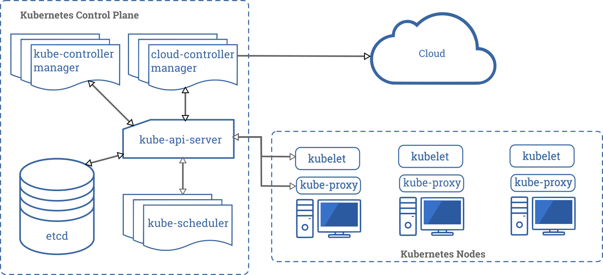

## Kubernetes


传统部署时代->虚拟化部署时代->容器部署时代


### 功能特性：

- **服务发现和负载均衡**
  Kubernetes 可以使用 DNS 名称或自己的 IP 地址公开容器，如果到容器的流量很大，Kubernetes 可以负载均衡并分配网络流量，从而使部署稳定。

- **存储编排**
  Kubernetes 允许您自动挂载您选择的存储系统，例如本地存储、公共云提供商等。

- **自动部署和回滚**
  您可以使用 Kubernetes 描述已部署容器的所需状态，它可以以受控的速率将实际状态更改为所需状态。例如，您可以自动化 Kubernetes 来为您的部署创建新容器，删除现有容器并将它们的所有资源用于新容器。

- **自动二进制打包**
  Kubernetes 允许您指定每个容器所需 CPU 和内存（RAM）。当容器指定了资源请求时，Kubernetes 可以做出更好的决策来管理容器的资源。

- **自我修复**
  Kubernetes 重新启动失败的容器、替换容器、杀死不响应用户定义的运行状况检查的容器，并且在准备好服务之前不将其通告给客户端。

- **密钥与配置管理**
  Kubernetes 允许您存储和管理敏感信息，例如密码、OAuth 令牌和 ssh 密钥。您可以在不重建容器镜像的情况下部署和更新密钥和应用程序配置，也无需在堆栈配置中暴露密钥。

一个 Kubernetes 集群包含 集群由一组被称作节点的机器组成。这些节点上运行 Kubernetes 所管理的容器化应用。集群具有至少一个工作节点和至少一个主节点。

工作节点托管作为应用程序组件的 Pod 。主节点管理集群中的工作节点和 Pod 。多个主节点用于为集群提供故障转移和高可用性。



#### Control Plane

apiserver：restful统一集群入口，交给etcd存储

etcd：键值数据库

scheduler：监视新创建为指定运行节点的Pod，调度决策

controller-manager：

​	节点控制器：故障通知响应

​	副本(Replication)控制器：维护副本Pod数量

​	端点控制器：填充端点对象(加入Service和Pod)

​	服务账户和令牌控制：新命名空间创建账户和API访问令牌

#### Node

kubelet：节点运行代理，保证容器运行在Pod中

kube-proxy：网络代理，维护节点的网络规则

### 核心概念

Pod：最小部署单元，一组容器的集合，一个Pod中容器共享网络

Controller：确保Pod副本数量，确保所有Node运行同一个Pod，一次性任务和定时任务

Service：定义一组Pod的访问规则

## 通过Kubeadm集群配置实例

### Kubeadm核心指令

```shell
# 创建一个 Master 节点
$ kubeadm init
# 将一个 Node 节点加入到当前集群中
$ kubeadm join <Master节点的IP和端口 >
```

### 虚拟机配置

采用Paralles Desktop安装CentOS Minimal系统


安装wget指令：

```shell
yum install wget
```

默认的网络设置是没有enable的，因此，在安装完之后需要开启的话，需要保证开启”Shared Network”, 同时再运行命令”/sbin/dhclient eth0”, 这样虚拟机就可以通过宿主网络来进行访问了。

为了长久性，修改配置

```shell
sudo vi /etc/sysconfig/network-scripts/ifcfg-eth0

# 将其中的ONBOOT改为yes
ONBOOT=yes
```

采用FinalShell进行SSH连接，配置三台服务器(一个Master，两个Node)


FinalShell可以实时查看CPU、网络等运行状态


### 环境配置

```shell
# 关闭防火墙
systemctl stop firewalld
systemctl disable firewalld

# 关闭selinux
sed -i 's/enforcing/disabled/' /etc/selinux/config  # 永久
setenforce 0  # 临时

# 关闭swap
swapoff -a  # 临时
sed -ri 's/.*swap.*/#&/' /etc/fstab    # 永久

# 根据规划设置主机名
hostnamectl set-hostname <hostname>

# 在master添加hosts 这里的名字和主机名对应
cat >> /etc/hosts << EOF
192.168.1.14 k8smaster
192.168.1.15 k8snode1
192.168.1.16 k8snode2
EOF

# 将桥接的IPv4流量传递到iptables的链
cat > /etc/sysctl.d/k8s.conf << EOF
net.bridge.bridge-nf-call-ip6tables = 1
net.bridge.bridge-nf-call-iptables = 1
EOF
sysctl --system  # 生效

# 时间同步
yum install ntpdate -y
ntpdate time.windows.com
```

### 节点安装Docker、kubeadm、kubelet

Kubernetes默认CRI(容器运行时)为Docker

1、Docker安装

2、注册阿里云镜像服务

3、添加阿里云yum软件源

```shell
$ cat > /etc/yum.repos.d/kubernetes.repo << EOF
[kubernetes]
name=Kubernetes
baseurl=https://mirrors.aliyun.com/kubernetes/yum/repos/kubernetes-el7-x86_64
enabled=1
gpgcheck=0
repo_gpgcheck=0
gpgkey=https://mirrors.aliyun.com/kubernetes/yum/doc/yum-key.gpg https://mirrors.aliyun.com/kubernetes/yum/doc/rpm-package-key.gpg
EOF
```

4、安装kubeadm、kubelet和kubectl

```shell
$ yum install -y kubelet-1.18.0 kubeadm-1.18.0 kubectl-1.18.0
$ systemctl enable kubelet
```

### 部署Master节点

```shell
$ kubeadm init \
  --apiserver-advertise-address=192.168.1.11 \
  --image-repository registry.aliyuncs.com/google_containers \
  --kubernetes-version v1.18.0 \
  --service-cidr=10.96.0.0/12 \
  --pod-network-cidr=10.244.0.0/16
```

使用kubectl工具

```shell
mkdir -p $HOME/.kube
sudo cp -i /etc/kubernetes/admin.conf $HOME/.kube/config
sudo chown $(id -u):$(id -g) $HOME/.kube/config
$ kubectl get nodes
```

### 部署Node节点

```shell
$ kubeadm join 192.168.1.11:6443 --token esce21.q6hetwm8si29qxwn \
    --discovery-token-ca-cert-hash sha256:00603a05805807501d7181c3d60b478788408cfe6cedefedb1f97569708be9c5

# 生成新的token
kubeadm token create --print-join-command
```

### 部署CNI网络插件

```shell
# 地址无法访问，添加IP地址
sudo vi /etc/hosts
199.232.28.133 raw.githubusercontent.com

# 部署插件
kubectl apply -f https://raw.githubusercontent.com/coreos/flannel/master/Documentation/kube-flannel.yml
```

### 集群运行


Master组件：coredns、etcd、flannel-ds、apiserver、controller-manager、proxy、scheduler

Node组件：flannel-ds、proxy

### 测试kubernetes集群pod

```shell
# 新建一个nginx pod
$ kubectl create deployment nginx --image=nginx
$ kubectl expose deployment nginx --port=80 --type=NodePort
$ kubectl get pod,sv
```


可以看到pod已经在运行。根据ip地址加端口号访问，例：192.168.1.11:31557可看到访问结果：


## 通过二进制方式集群配置实例

### 配置三台虚拟机环境


初始化环境配置和adm方式相同。需要配置的环境如下：

| 角色       | IP           | 组件                                                         |
| ---------- | :----------- | ------------------------------------------------------------ |
| k8s-master | 192.168.1.14 | kube-apiserver，kube-controller-manager，kube-scheduler，etcd |
| k8s-node1  | 192.168.1.15 | kubelet，kube-proxy，docker，etcd                            |
| k8s-node2  | 192.168.1.16 | kubelet，kube-proxy，docker，etcd                            |

### 自签证书

为etcd和apiserver自签证书。CFSSL是开源证书管理工具，使用json文件生成证书。

#### 下载配置cfssl

 ```shell
wget https://pkg.cfssl.org/R1.2/cfssl_linux-amd64
wget https://pkg.cfssl.org/R1.2/cfssljson_linux-amd64
wget https://pkg.cfssl.org/R1.2/cfssl-certinfo_linux-amd64
chmod +x cfssl_linux-amd64 cfssljson_linux-amd64 cfssl-certinfo_linux-amd64
mv cfssl_linux-amd64 /usr/local/bin/cfssl
mv cfssljson_linux-amd64 /usr/local/bin/cfssljson
mv cfssl-certinfo_linux-amd64 /usr/local/bin/cfssl-certinfo
 ```

#### 自签证书颁发机构

```shell
#工作目录
mkdir -p ~/TLS/{etcd,k8s}
cd TLS/etcd
```

```shell
#自签CA
cat > ca-config.json<< EOF 
{ 
  "signing": { 
    "default": { 
    	"expiry": "87600h" 
     },
  "profiles": { 
    "www": { 
      "expiry": "87600h", 
      "usages": [ 
        "signing",
        "key encipherment", 
        "server auth", 
        "client auth" 
        ] 
      } 
    } 
  } 
}
EOF

cat > ca-csr.json<< EOF 
{ 
  "CN": "etcd CA", 
  "key": { 
    "algo": "rsa", 
    "size": 2048 
  },
  "names": [ 
    { 
    "C": "CN", 
    "L": "Beijing", 
    "ST": "Beijing" 
    } 
  ] 
}
EOF
```

```shell
#证书生成
cfssl gencert -initca ca-csr.json | cfssljson -bare ca
```

```shell
#使用自签CA签发Etcd HTTPS证书
#证书申请文件：
cat > server-csr.json<< EOF
{
  "CN": "etcd",
  "hosts": ["192.168.1.14", "192.168.1.15", "192.168.1.16"],
  "key": {
    "algo": "rsa",
    "size": 2048
  },
  "names": [{
    "C": "CN",
    "L": "BeiJing",
    "ST": "BeiJing"
  }]
}
EOF
```

```shell
#生成证书
cfssl gencert -ca=ca.pem -ca-key=ca-key.pem -config=ca-config.json -profile=www server-csr.json | cfssljson -bare server
```

生成证书：


### 部署etcd集群

下载etcd：https://github.com/etcd-io/etcd/releases/tag/v3.4.13

```shell
#创建工作目录并解压二进制包
mkdir /opt/etcd/{bin,cfg,ssl} –p
tar zxvf etcd-v3.4.13-linux-amd64.tar.gz
mv etcd-v3.4.13-linux-amd64/{etcd,etcdctl} /opt/etcd/bin/
```

```shell
#etcd配置文件
cat > /opt/etcd/cfg/etcd.conf << EOF
#[Member]
#节点名称
ETCD_NAME="etcd-1"
#数据目录
ETCD_DATA_DIR="/var/lib/etcd/default.etcd"
#集群通信监听地址
ETCD_LISTEN_PEER_URLS="https://192.168.1.14:2380"
#客户端访问监听地址
ETCD_LISTEN_CLIENT_URLS="https://192.168.1.14:2379"
#[Clustering]
#集群通告地址
ETCD_INITIAL_ADVERTISE_PEER_URLS="https://192.168.1.14:2380"
#客户端通告地址
ETCD_ADVERTISE_CLIENT_URLS="https://192.168.1.14:2379" 
#集群节点地址
ETCD_INITIAL_CLUSTER="etcd-1=https://192.168.1.14:2380,etcd-2=https://192.168.1.15:2380,etcd-3=https://192.168.1.16:2380" 
#集群token
ETCD_INITIAL_CLUSTER_TOKEN="etcd-cluster"
#加入集群的当前状态，new新集群，existing已有集群
ETCD_INITIAL_CLUSTER_STATE="new"
EOF
```

```shell
#systemd管理etcd
cat > /usr/lib/systemd/system/etcd.service << EOF
[Unit]
Description=Etcd Server
After=network.target
After=network-online.target
Wants=network-online.target
[Service]
Type=notify
EnvironmentFile=/opt/etcd/cfg/etcd.conf
ExecStart=/opt/etcd/bin/etcd \
--cert-file=/opt/etcd/ssl/server.pem \
--key-file=/opt/etcd/ssl/server-key.pem \
--peer-cert-file=/opt/etcd/ssl/server.pem \
--peer-key-file=/opt/etcd/ssl/server-key.pem \
--trusted-ca-file=/opt/etcd/ssl/ca.pem \
--peer-trusted-ca-file=/opt/etcd/ssl/ca.pem \
--logger=zap
Restart=on-failure
LimitNOFILE=65536
[Install]
WantedBy=multi-user.target
EOF
```

```shell
#拷贝证书
cp ~/TLS/etcd/ca*pem ~/TLS/etcd/server*pem /opt/etcd/ssl/
#设置开机启动
systemctl daemon-reload
systemctl start etcd
systemctl enable etcd
```

```shell
#将生成文件拷贝到其他节点
scp -r /opt/etcd/ root@192.168.1.15:/opt/
scp /usr/lib/systemd/system/etcd.service root@192.168.1.15:/usr/lib/systemd/system/
scp -r /opt/etcd/ root@192.168.1.16:/opt/
scp /usr/lib/systemd/system/etcd.service root@192.168.1.16:/usr/lib/systemd/system/

#分别修改其中的ETCD_NAME和地址为当前ip
vi /usr/lib/systemd/system/etcd.service
```

```shell
#查看集群部署状态
ETCDCTL_API=3 /opt/etcd/bin/etcdctl --cacert=/opt/etcd/ssl/ca.pem --cert=/opt/etcd/ssl/server.pem --key=/opt/etcd/ssl/server-key.pem --endpoints="https://192.168.1.14:2379,https://192.168.1.15:2379,https://192.168.1.16:2379" endpoint health
```

etcd集群已经部署成功


### 安装docker

```shell
#下载docker并配置
wget https://download.docker.com/linux/static/stable/x86_64/docker-19.03.9.tgz
tar zxvf docker-19.03.9.tgz
mv docker/* /usr/bin
```

```shell
#systemd管理docker
cat > /usr/lib/systemd/system/docker.service << EOF
[Unit]
Description=Docker Application Container Engine
Documentation=https://docs.docker.com
After=network-online.target firewalld.service
Wants=network-online.target
[Service]
Type=notify
ExecStart=/usr/bin/dockerd
ExecReload=/bin/kill -s HUP $MAINPID
LimitNOFILE=infinity
LimitNPROC=infinity
LimitCORE=infinity
TimeoutStartSec=0
Delegate=yes
KillMode=process
Restart=on-failure
StartLimitBurst=3
StartLimitInterval=60s
[Install]
WantedBy=multi-user.target
EOF
```

```shell
#创建配置文件
mkdir /etc/docker
cat > /etc/docker/daemon.json << EOF
{
  "registry-mirrors":["https://ach7yopc.mirror.aliyuncs.com"]
}
EOF

#开启docker
systemctl daemon-reload
systemctl start docker
systemctl enable docker
```


### 为apiserver自签证书

自签CA和etcd相同，配置相同。

```shell
#自签CA
cat > ca-config.json<< EOF 
{ 
  "signing": { 
    "default": { 
    	"expiry": "87600h" 
     },
  "profiles": { 
    "kubernetes": { 
      "expiry": "87600h", 
      "usages": [ 
        "signing",
        "key encipherment", 
        "server auth", 
        "client auth" 
        ] 
      } 
    } 
  } 
}
EOF

cat > ca-csr.json<< EOF 
{ 
  "CN": "kubernetes", 
  "key": { 
    "algo": "rsa", 
    "size": 2048 
  },
  "names": [ 
    { 
    "C": "CN", 
    "L": "Beijing", 
    "ST": "Beijing",
    "O": "k8s",
    "OU": "System"
    } 
  ] 
}
EOF
```

```shell
#证书生成
cfssl gencert -initca ca-csr.json | cfssljson -bare ca
```

```shell
#使用自签CA签发kuber-apiserver https证书
cat > server-csr.json<< EOF
{
    "CN":"kubernetes",
    "hosts":[
        "10.0.0.1",
        "127.0.0.1",
        "192.168.1.14",
        "192.168.1.15",
        "192.168.1.16",
        "192.168.1.17",
        "192.168.1.18",
        "192.168.1.19",
        "192.168.1.20",
        "kubernetes",
        "kubernetes.default",
        "kubernetes.default.svc",
        "kubernetes.default.svc.cluster",
        "kubernetes.default.svc.cluster.local"
    ],
    "key":{
        "algo":"rsa",
        "size":2048
    },
    "names":[
        {
            "C":"CN",
            "L":"BeiJing",
            "ST":"BeiJing",
            "O":"k8s",
            "OU":"System"
        }
    ]
}
EOF
```

```shell
#生成证书
cfssl gencert -ca=ca.pem -ca-key=ca-key.pem -config=ca-config.json -profile=kubernetes server-csr.json | cfssljson -bare server
```

### 部署master组件

下载地址：

https://github.com/kubernetes/kubernetes/blob/master/CHANGELOG/CHANGELOG-1.19.md#v1192

```shell
#解压 可执行文件apiserver scheduler controller-manager kubectl
mkdir -p /opt/kubernetes/{bin,cfg,ssl,logs}
tar zxvf kubernetes-server-linux-amd64.tar.gz
cd kubernetes/server/bin
cp kube-apiserver kube-scheduler kube-controller-manager /opt/kubernetes/bin
cp kubectl /usr/bin/
```

```shell
#apiserver配置文件
cat > /opt/kubernetes/cfg/kube-apiserver.conf << EOF
KUBE_APISERVER_OPTS="--logtostderr=false \\
#日志等级
--v=2 \\
#日志目录
--log-dir=/opt/kubernetes/logs \\
#etcd集群地址
--etcd-servers=https://192.168.1.14:2379,https://192.168.1.15:2379,https://192.168.1.16:2379 \\
#监听地址
--bind-address=192.168.1.14 \\
#https安全端口
--secure-port=6443 \\
#集群通告地址
--advertise-address=192.168.1.14 \\
#启用授权
--allow-privileged=true \\
#Service虚拟IP地址段
--service-cluster-ip-range=10.0.0.0/24 \\
#准入控制模块
--enable-admission-plugins=NamespaceLifecycle,LimitRanger,ServiceAccount,ResourceQuota,NodeRestriction \\
#认证授权，启用RBAC授权和节点自管理
--authorization-mode=RBAC,Node \\
#启用TLS bootstrap机制
--enable-bootstrap-token-auth=true \\
#bootstrap token文件
--token-auth-file=/opt/kubernetes/cfg/token.csv \\
#Service nodeport类型默认分配端口范围
--service-node-port-range=30000-32767 \\
#apiserver访问kubelet客户端证书
--kubelet-client-certificate=/opt/kubernetes/ssl/server.pem \\
--kubelet-client-key=/opt/kubernetes/ssl/server-key.pem \\
#apiserver https证书
--tls-cert-file=/opt/kubernetes/ssl/server.pem \\
--tls-private-key-file=/opt/kubernetes/ssl/server-key.pem \\
--client-ca-file=/opt/kubernetes/ssl/ca.pem \\
--service-account-key-file=/opt/kubernetes/ssl/ca-key.pem \\
#连接etcd集群证书
--etcd-cafile=/opt/etcd/ssl/ca.pem \\
--etcd-certfile=/opt/etcd/ssl/server.pem \\
--etcd-keyfile=/opt/etcd/ssl/server-key.pem \\
#审计日志
--audit-log-maxage=30 \\
--audit-log-maxbackup=3 \\
--audit-log-maxsize=100 \\
--audit-log-path=/opt/kubernetes/logs/k8s-audit.log"
EOF
```

```shell
#将证书拷贝到配置路径
cp ~/TLS/k8s/ca*pem ~/TLS/k8s/server*pem /opt/kubernetes/ssl/
```

### TLS Bootstraping

Master apiserver 启用 TLS 认证后，Node 节点 kubelet 和 kube-proxy 要与 kube-apiserver 进行通信，必须使用 CA 签发的有效证书才可以，当 Node 节点很多时，这种客户端证书颁发需要大量工作，同样也会增加集群扩展复杂度。为了简化流程，Kubernetes 引入了 TLS bootstraping 机制来自动颁发客户端证书，kubelet 会以一个低权限用户自动向 apiserver 申请证书，kubelet 的证书由 apiserver 动态签署。

```shell
#生成tocken
head -c 16 /dev/urandom | od -An -t x | tr -d ' '

#配置
cat > /opt/kubernetes/cfg/token.csv << EOF
38c9abdf7eea167c6526158f19475b2d,kubelet-bootstrap,10001,"system:node-bootstrapper"
EOF
```

```shell
#systemd管理apiserver
cat > /usr/lib/systemd/system/kube-apiserver.service << EOF
[Unit]
Description=Kubernetes API Server
Documentation=https://github.com/kubernetes/kubernetes
[Service]
EnvironmentFile=/opt/kubernetes/cfg/kube-apiserver.conf
ExecStart=/opt/kubernetes/bin/kube-apiserver \$KUBE_APISERVER_OPTS
Restart=on-failure
[Install]
WantedBy=multi-user.target
EOF
```

```shell
#启动kube-apiserver
systemctl daemon-reload
systemctl start kube-apiserver
systemctl enable kube-apiserver
```

```shell
#授权kubelet-bootstrap用户允许请求证书
kubectl create clusterrolebinding kubelet-bootstrap \
--clusterrole=system:node-bootstrapper \
--user=kubelet-bootstrap
```

部署kube-controller-manager

```shell
cat > /opt/kubernetes/cfg/kube-controller-manager.conf << EOF
KUBE_CONTROLLER_MANAGER_OPTS="--logtostderr=false \\
--v=2 \\
--log-dir=/opt/kubernetes/logs \\
--leader-elect=true \\
--master=127.0.0.1:8080 \\
--bind-address=127.0.0.1 \\
--allocate-node-cidrs=true \\
--cluster-cidr=10.244.0.0/16 \\
--service-cluster-ip-range=10.0.0.0/24 \\
--cluster-signing-cert-file=/opt/kubernetes/ssl/ca.pem \\
--cluster-signing-key-file=/opt/kubernetes/ssl/ca-key.pem \\
--root-ca-file=/opt/kubernetes/ssl/ca.pem \\
--service-account-private-key-file=/opt/kubernetes/ssl/ca-key.pem \\
--experimental-cluster-signing-duration=87600h0m0s"
EOF
```

```shell
#systemd管理controller-manager
cat > /usr/lib/systemd/system/kube-controller-manager.service << EOF
[Unit]
Description=Kubernetes Controller Manager
Documentation=https://github.com/kubernetes/kubernetes
[Service]
EnvironmentFile=/opt/kubernetes/cfg/kube-controller-manager.conf
ExecStart=/opt/kubernetes/bin/kube-controller-manager \$KUBE_CONTROLLER_MANAGER_OPTS
Restart=on-failure
[Install]
WantedBy=multi-user.target
EOF
```

```shell
systemctl daemon-reload
systemctl start kube-controller-manager
systemctl enable kube-controller-manager
```

部署kube-scheduler

```shell
cat > /opt/kubernetes/cfg/kube-scheduler.conf << EOF
KUBE_SCHEDULER_OPTS="--logtostderr=false \
--v=2 \
--log-dir=/opt/kubernetes/logs \
--leader-elect \
--master=127.0.0.1:8080 \
--bind-address=127.0.0.1"
EOF
```

```shell
cat > /usr/lib/systemd/system/kube-scheduler.service << EOF
[Unit]
Description=Kubernetes Scheduler
Documentation=https://github.com/kubernetes/kubernetes
[Service]
EnvironmentFile=/opt/kubernetes/cfg/kube-scheduler.conf
ExecStart=/opt/kubernetes/bin/kube-scheduler \$KUBE_SCHEDULER_OPTS
Restart=on-failure
[Install]
WantedBy=multi-user.target
EOF
```

```shell
systemctl daemon-reload
systemctl start kube-scheduler
systemctl enable kube-scheduler
```

部署完成后可以查看集群运行状态

```shell
kubectl get cs
```


### 部署node组件

在master节点下载的kubernetes中有kubelet和kube-proxy组件


```shell
#工作目录 在master节点操作
mkdir -p /opt/kubernetes/{bin,cfg,ssl,logs}
cd kubernetes/server/bin
cp kubelet kube-proxy /opt/kubernetes/bin # 本地拷贝

# 拷贝到每个node节点
scp kubelet kube-proxy k8snode1:/opt/kubernetes/bin/
scp kubelet kube-proxy k8snode2:/opt/kubernetes/bin/
```

#### 部署kubelet

```shell
#配置文件
cat > /opt/kubernetes/cfg/kubelet.conf << EOF
KUBELET_OPTS="--logtostderr=false \\
--v=2 \\
--log-dir=/opt/kubernetes/logs \\
#显示名称，集群中唯一
--hostname-override=k8smaster \\
#启用CNI插件
--network-plugin=cni \\
#用于连接apiserver
--kubeconfig=/opt/kubernetes/cfg/kubelet.kubeconfig \\
#首次启动向apiserver申请证书
--bootstrap-kubeconfig=/opt/kubernetes/cfg/bootstrap.kubeconfig \\
#配置参数文件
--config=/opt/kubernetes/cfg/kubelet-config.yml \\
#kubelet证书生成目录
--cert-dir=/opt/kubernetes/ssl \\
#管理Pod网络容器的镜像
--pod-infra-container-image=mirrorgooglecontainers/pause-amd64:3.0"
EOF
```

```yml
cat > /opt/kubernetes/cfg/kubelet-config.yml << EOF
kind: KubeletConfiguration
apiVersion: kubelet.config.k8s.io/v1beta1
address: 0.0.0.0
port: 10250
readOnlyPort: 10255
cgroupDriver: cgroupfs
clusterDNS:
- 10.0.0.2
clusterDomain: cluster.local 
failSwapOn: false
authentication:
  anonymous:
    enabled: false
  webhook:
    cacheTTL: 2m0s
    enabled: true
  x509:
    clientCAFile: /opt/kubernetes/ssl/ca.pem 
authorization:
  mode: Webhook
  webhook:
    cacheAuthorizedTTL: 5m0s
    cacheUnauthorizedTTL: 30s
evictionHard:
  imagefs.available: 15%
  memory.available: 100Mi
  nodefs.available: 10%
  nodefs.inodesFree: 5%
maxOpenFiles: 1000000
maxPods: 110
EOF
```

```shell
# bootstrap.kubeconfig
KUBE_APISERVER="https://192.168.1.14:6443" # apiserver IP:PORT
TOKEN="38c9abdf7eea167c6526158f19475b2d" # 与token.csv里保持一致

cd /root/TLS/k8s

# 生成 kubelet bootstrap kubeconfig 配置文件
kubectl config set-cluster kubernetes \
  --certificate-authority=/opt/kubernetes/ssl/ca.pem \
  --embed-certs=true \
  --server=${KUBE_APISERVER} \
  --kubeconfig=bootstrap.kubeconfig
  
kubectl config set-credentials "kubelet-bootstrap" \
  --token=${TOKEN} \
  --kubeconfig=bootstrap.kubeconfig
  
kubectl config set-context default \
  --cluster=kubernetes \
  --user="kubelet-bootstrap" \
  --kubeconfig=bootstrap.kubeconfig
  
kubectl config use-context default --kubeconfig=bootstrap.kubeconfig
```

```shell
#拷贝配置文件路径
cp /root/TLS/k8s/bootstrap.kubeconfig /opt/kubernetes/cfg
```

```shell
# systemd 管理 kubelet
cat > /usr/lib/systemd/system/kubelet.service << EOF
[Unit]
Description=Kubernetes Kubelet
After=docker.service
[Service]
EnvironmentFile=/opt/kubernetes/cfg/kubelet.conf
ExecStart=/opt/kubernetes/bin/kubelet \$KUBELET_OPTS
Restart=on-failure
LimitNOFILE=65536
[Install]
WantedBy=multi-user.target
EOF
```

```shell
# 启动服务
systemctl daemon-reload
systemctl start kubelet
systemctl enable kubelet
```

批准kubelet证书申请并加入集群

```shell
# 查看kubelet证书请求
kubectl get csr
# 批准申请
kubectl certificate approve xxxxxxxxxxx
# 查看节点
kubectl get node
```

由于未部署网络插件，节点回没有准备就绪NotReady


#### 部署kube-proxy

```shell
# 配置文件
cat > /opt/kubernetes/cfg/kube-proxy.conf << EOF
KUBE_PROXY_OPTS="--logtostderr=false \\
--v=2 \\
--log-dir=/opt/kubernetes/logs \\
--config=/opt/kubernetes/cfg/kube-proxy-config.yml"
EOF
```

```yaml
# 配置yml
cat > /opt/kubernetes/cfg/kube-proxy-config.yml << EOF
kind: KubeProxyConfiguration
apiVersion: kubeproxy.config.k8s.io/v1alpha1
bindAddress: 0.0.0.0
metricsBindAddress: 0.0.0.0:10249
clientConnection:
	kubeconfig: /opt/kubernetes/cfg/kube-proxy.kubeconfig
hostnameOverride: k8smaster
clusterCIDR: 10.0.0.0/24
EOF
```

```shell
# 生成kube-proxy证书
# 切换工作目录
cd /usr/local/bin/k8s

# 创建证书请求文件
cat > kube-proxy-csr.json << EOF
{
  "CN": "system:kube-proxy",
  "hosts": [],
  "key": {
    "algo": "rsa",
    "size": 2048
  },
  "names": [
    {
      "C": "CN",
      "L": "BeiJing",
      "ST": "BeiJing",
      "O": "k8s",
      "OU": "System"
    }
  ]
}
EOF

# 生成证书
cfssl gencert -ca=ca.pem -ca-key=ca-key.pem -config=ca-config.json -profile=kubernetes kube-proxy-csr.json | cfssljson -bare kube-proxy

ls kube-proxy*pem
# kube-proxy-key.pem  kube-proxy.pem
```

```shell
# kubeconfig文件
KUBE_APISERVER="https://192.168.1.14:6443"

cd /root/TLS/k8s

kubectl config set-cluster kubernetes \
  --certificate-authority=/opt/kubernetes/ssl/ca.pem \
  --embed-certs=true \
  --server=${KUBE_APISERVER} \
  --kubeconfig=kube-proxy.kubeconfig
  
kubectl config set-credentials kube-proxy \
  --client-certificate=./kube-proxy.pem \
  --client-key=./kube-proxy-key.pem \
  --embed-certs=true \
  --kubeconfig=kube-proxy.kubeconfig
  
kubectl config set-context default \
  --cluster=kubernetes \
  --user=kube-proxy \
  --kubeconfig=kube-proxy.kubeconfig
  
  
kubectl config use-context default --kubeconfig=kube-proxy.kubeconfig
```

```shell
# 拷贝配置文件
cp /root/TLS/k8s/kube-proxy.kubeconfig /opt/kubernetes/cfg/
```

```shell
# systemd管理kube-proxy
cat > /usr/lib/systemd/system/kube-proxy.service << EOF
[Unit]
Description=Kubernetes Proxy
After=network.target
[Service]
EnvironmentFile=/opt/kubernetes/cfg/kube-proxy.conf
ExecStart=/opt/kubernetes/bin/kube-proxy \$KUBE_PROXY_OPTS
Restart=on-failure
LimitNOFILE=65536
[Install]
WantedBy=multi-user.target
EOF
```

```shell
# 启动kube-proxy
systemctl daemon-reload
systemctl start kube-proxy
systemctl enable kube-proxy
```

#### 部署CNI网络

```shell
mkdir -p /opt/cni/bin
tar zxvf cni-plugins-linux-amd64-v0.8.6.tgz -C /opt/cni/bin

# 地址无法访问，添加IP地址
sudo vi /etc/hosts
199.232.28.133 raw.githubusercontent.com

wget https://raw.githubusercontent.com/coreos/flannel/master/Documentation/kube-flannel.yml
kubectl apply -f kube-flannel.yml

kubectl get pods -n kube-system
```


授权apiserver访问kubelet

```shell
cat > apiserver-to-kubelet-rbac.yaml << EOF
apiVersion: rbac.authorization.k8s.io/v1
kind: ClusterRole
metadata:
  annotations:
    rbac.authorization.kubernetes.io/autoupdate: "true"
  labels:
    kubernetes.io/bootstrapping: rbac-defaults
  name: system:kube-apiserver-to-kubelet
rules:
  - apiGroups:
      - ""
    resources:
      - nodes/proxy
      - nodes/stats
      - nodes/log
      - nodes/spec
      - nodes/metrics
      - pods/log
    verbs:
      - "*"
---
apiVersion: rbac.authorization.k8s.io/v1
kind: ClusterRoleBinding
metadata:
  name: system:kube-apiserver
  namespace: ""
roleRef:
  apiGroup: rbac.authorization.k8s.io
  kind: ClusterRole
  name: system:kube-apiserver-to-kubelet
subjects:
  - apiGroup: rbac.authorization.k8s.io
    kind: User
    name: kubernetes
EOF

kubectl apply -f apiserver-to-kubelet-rbac.yaml
```

```shell
# 增加新的Node节点
scp -r /opt/kubernetes k8snode2:/opt/
scp -r /usr/lib/systemd/system/{kubelet,kube-proxy}.service k8snode2:/usr/lib/systemd/system
scp -r /opt/cni/ k8snode2:/opt/
scp /opt/kubernetes/ssl/ca.pem k8snode2:/opt/kubernetes/ssl

# 证书申请审批后自动生成，删除重新生成
rm /opt/kubernetes/cfg/kubelet.kubeconfig 
rm -f /opt/kubernetes/ssl/kubelet*

# 修改主机名
vi /opt/kubernetes/cfg/kubelet.conf
--hostname-override=k8snode1
vi /opt/kubernetes/cfg/kube-proxy-config.yml
hostnameOverride: k8snode1
```

```shell
# 启动kubelet和kube-proxy
systemctl daemon-reload
systemctl start kubelet
systemctl enable kubelet
systemctl start kube-proxy
systemctl enable kube-proxy
```

在master批准node kubelet证书申请

```shell
kubectl get csr
kubectl certificate approve xxxxxxxxx
```


查看Node状态，各个节点已正常运行中


### 部署集群网络


## 参考

mac下Paralles配置CentOS网络：https://www.cnblogs.com/ghj1976/p/3746375.html

环境搭建1：https://www.cnblogs.com/liuyi778/p/12771259.html

环境搭建2：https://www.cnblogs.com/oscarli/p/12737409.html

CFSSL证书生成：https://blog.csdn.net/sujosu/article/details/101520260